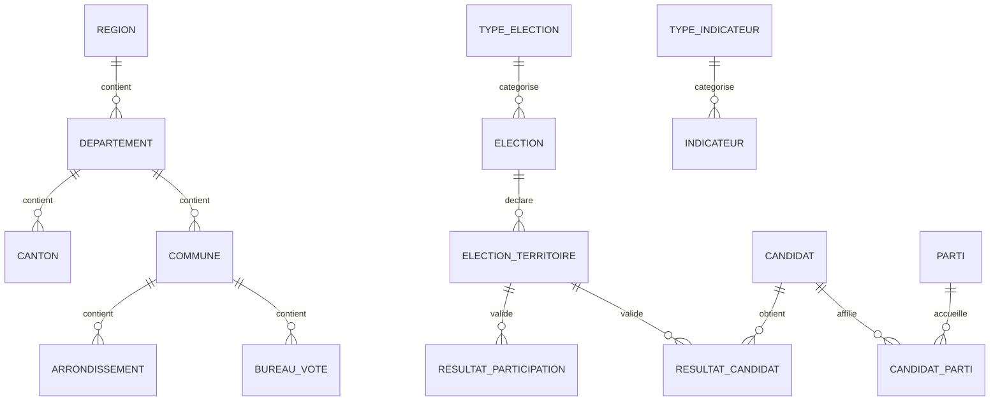
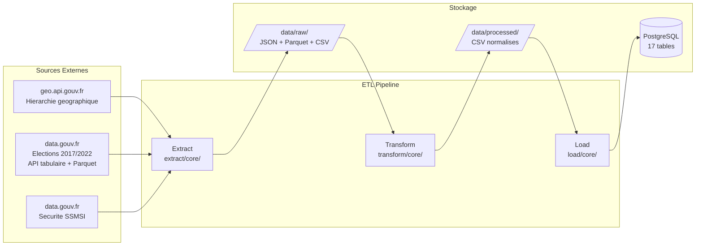
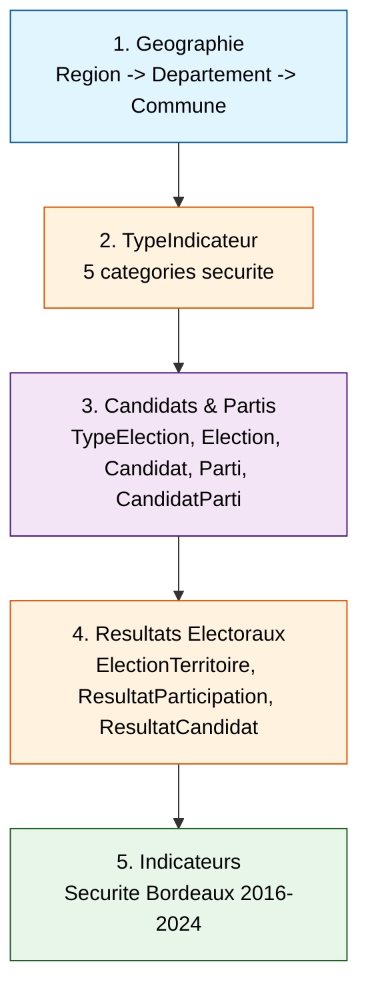
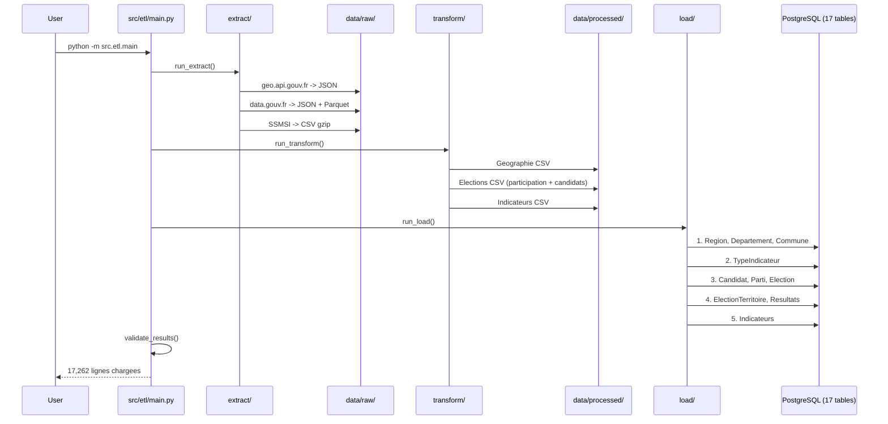

# Architecture ETL & Database - Electio-Analytics

**Version :** 3.0 (Schema Enrichi Multi-Granularites + Architecture Modulaire)

**Date :** 2026-02-12

**Perimetre :** Bordeaux (Gironde) - Presidentielles 2017 & 2022 (1er et 2nd tours) -> Prediction 2027

**Tech Lead :** @tech + @de + @ds

**Decisions Architecturales :**
- ADR-003 (Architecture ETL Modulaire Option 3)
- ADR-004 (Enrichissement Schema Base de Donnees v3.0)

**Documents Associes :**
- [MCD v3.0](./database/01-mcd.md) - Modele Conceptuel de Donnees
- [MLD v3.0](./database/02-mld.md) - Modele Logique de Donnees
- [Dictionnaire de Donnees v3.0](./database/03-dictionnaire-donnees.md) - Description exhaustive des colonnes

---

## Schema Base de Donnees v3.0

### Vue d'Ensemble

Le schema de base de donnees a ete **enrichi et normalise** (3NF) pour supporter :
- **Multi-granularites territoriales** (BUREAU, CANTON, COMMUNE, DEPARTEMENT, REGION)
- **Referentiels candidats et partis** (tracking historique, profil ideologique)
- **Separation participation/resultats** (elimination redondances)
- **Tracabilite granularites** (table `election_territoire`)
- **Systeme polymorphe** `(id_territoire, type_territoire)` pour indicateurs et resultats

### Architecture



### Tables (17)

| Domaine | Tables | Role |
|---------|--------|------|
| **Geographique** | region, departement, canton, commune, arrondissement, bureau_vote | Hierarchie multi-niveaux |
| **Candidats/Partis** | candidat, parti, candidat_parti | Referentiels normalises |
| **Elections** | type_election, election, election_territoire | Evenements + referentiel granularites |
| **Resultats** | resultat_participation, resultat_candidat | Separation stats generales vs candidats |
| **Indicateurs** | type_indicateur, indicateur | Pattern EAV polymorphe |
| **ML** | prediction | Predictions generees |

### Features ML Exploitables

**Avant (schema v2.0) :** ~10 features
**Apres (schema v3.0) :** ~35 features exploitables

**Reference complete :** [MCD v3.0](./database/01-mcd.md)

---

## Vue d'Ensemble ETL

Le pipeline ETL (Extract-Transform-Load) centralise les donnees electorales et socio-economiques depuis 3 sources externes (geo.api.gouv.fr, data.gouv.fr API tabulaire, SSMSI).


---

## Architecture Modulaire (Option 3)

### Structure du Module ETL

```
src/etl/
├── extract/                    # Extraction des donnees brutes
│   ├── config/                # Configuration centralisee
│   │   ├── __init__.py
│   │   └── settings.py        # URLs API, chemins, constantes
│   ├── core/                  # Logique metier par source
│   │   ├── __init__.py
│   │   ├── elections.py       # API tabulaire data.gouv.fr + Parquet
│   │   ├── geographie.py      # geo.api.gouv.fr (regions, depts, communes)
│   │   └── securite.py        # SSMSI CSV gzip
│   ├── utils/                 # Utilitaires generiques
│   │   ├── __init__.py
│   │   └── download.py        # download_file() avec barre de progression
│   ├── __init__.py            # Exports publics
│   └── main.py                # Orchestrateur extraction
│
├── transform/                  # Transformation des donnees
│   ├── config/                # Configuration centralisee
│   │   ├── __init__.py
│   │   └── settings.py        # Chemins, constantes, mappings
│   ├── core/                  # Logique metier par source
│   │   ├── __init__.py
│   │   ├── elections.py       # JSON participation + Parquet candidats -> CSV
│   │   ├── geographie.py      # JSON API -> CSV referentiels geo
│   │   └── securite.py        # CSV SSMSI -> indicateurs Bordeaux
│   ├── utils/                 # Utilitaires de parsing
│   │   ├── __init__.py
│   │   └── parsing.py         # parse_french_number()
│   ├── __init__.py            # Exports publics
│   └── main.py                # Orchestrateur transformation
│
├── load/                       # Chargement en base de donnees
│   ├── config/                # Configuration centralisee
│   │   ├── __init__.py
│   │   └── settings.py        # Chemins CSV, configs batch
│   ├── core/                  # Logique metier par domaine
│   │   ├── __init__.py
│   │   ├── geographie.py      # Region, Departement, Commune
│   │   ├── candidats.py       # TypeElection, Election, Candidat, Parti, CandidatParti
│   │   ├── elections.py       # ElectionTerritoire, ResultatParticipation, ResultatCandidat
│   │   ├── indicateurs.py     # Indicateur (batch 1000 rows)
│   │   └── type_indicateur.py # TypeIndicateur
│   ├── utils/                 # Validations
│   │   ├── __init__.py
│   │   └── validators.py      # Validation CSV (colonnes, types, valeurs)
│   ├── __init__.py            # Exports publics
│   └── main.py                # Orchestrateur chargement
│
├── __init__.py
├── main.py                     # Orchestrateur ETL global (E -> T -> L)
└── README.md                   # Documentation complete
```

### Principes Architecturaux

1. **Separation des responsabilites (SRP)**
   - `config/` : Configuration uniquement (URLs, chemins, constantes)
   - `core/` : Logique metier specifique a chaque source de donnees
   - `utils/` : Fonctions generiques reutilisables
   - `main.py` : Orchestration pure sans logique metier

2. **Scalabilite** : Ajout d'une nouvelle source = 1 fichier dans `core/`

3. **Testabilite** : Chaque module peut etre teste independamment

4. **Reutilisabilite** : Utilitaires dans `utils/` reutilisables partout

**Reference :** Voir `docs/02-architecture/adr/ADR-003-architecture-modulaire-etl.md`

---

## Architecture Globale



---

## Phase 1 : EXTRACT (Extraction)

### Sources de Donnees

#### Source 1 : Geographie (geo.api.gouv.fr)

**API :** `https://geo.api.gouv.fr`

| Endpoint | Donnees | Fichier de sortie |
|----------|---------|-------------------|
| `GET /regions` | Regions de France | `data/raw/geographie/regions.json` |
| `GET /departements/33` | Departement Gironde | `data/raw/geographie/departement_33.json` |
| `GET /departements/33/communes` | ~535 communes | `data/raw/geographie/communes_33.json` |

**Implementation :** `src/etl/extract/core/geographie.py`

---

#### Source 2 : Elections Presidentielles (data.gouv.fr)

**Donnees collectees :** 1er et 2nd tours pour 2017 et 2022

| Type | API / Format | Fichiers |
|------|-------------|----------|
| Participation | API tabulaire JSON pagine | `participation_{election_id}.json` x 4 |
| Candidats | Parquet (~151 MB) | `candidats_agrege.parquet` |
| Nuances | CSV | `nuances_politiques.csv` |

**IDs Elections :** `2017_pres_t1`, `2017_pres_t2`, `2022_pres_t1`, `2022_pres_t2`

**Filtrage :** Departement 33 (Gironde) via parametres API `code_departement__exact=33`

**Implementation :** `src/etl/extract/core/elections.py`

---

#### Source 3 : Securite / Criminalite (SSMSI)

**URL :** data.gouv.fr (dataset SSMSI bases communales de delinquance)
**Format :** CSV gzip (~34 MB)
**Periode :** 2016-2024
**Filtrage :** Commune 33063 (Bordeaux)

**Implementation :** `src/etl/extract/core/securite.py`

---

### Arborescence de Sortie (Extract)

```
data/raw/
├── geographie/
│   ├── regions.json                     (~2 KB)
│   ├── departement_33.json              (~1 KB)
│   └── communes_33.json                 (~200 KB)
├── elections/
│   ├── participation_2017_pres_t1.json  (~paginee)
│   ├── participation_2017_pres_t2.json
│   ├── participation_2022_pres_t1.json
│   ├── participation_2022_pres_t2.json
│   ├── candidats_agrege.parquet         (~151 MB)
│   └── nuances_politiques.csv
└── securite/
    └── delinquance_france_2016_2024.csv (~34 MB gzip)
```

---

## Phase 2 : TRANSFORM (Transformation)

### Transformations par Source

#### T1 : Geographie

- Filtrer region Nouvelle-Aquitaine (code=75)
- Extraire departement 33 et ses communes
- Generer CSV normalises pour le chargement

**Sortie :** `data/processed/geographie/{regions,departements,communes}.csv`

#### T2 : Elections

- **Participation :** Lire JSON par election, agreger par commune (sommer bureaux de vote)
- **Candidats :** Lire Parquet, filtrer dept=33 + presidentielles, agreger par commune
  - Detection auto ratio vs pourcentage (valeurs <= 1.0 multipliees par 100)
  - Gestion Arrow/pd.NA (`fillna("")` avant `astype(str)`)
- **Referentiels :** Extraire candidats uniques et nuances politiques

**Sortie :**
```
data/processed/elections/
├── participation_gironde.csv       (~2 140 lignes)
├── candidats_gironde.csv           (~14 484 lignes)
├── referentiel_candidats.csv       (~25 lignes)
├── referentiel_partis.csv          (~15 lignes)
└── nuances_politiques.csv
```

#### T3 : Securite

- Filtrer commune 33063 (Bordeaux) depuis fichier SSMSI
- Mapper categories : CRIMINALITE_TOTALE, VOLS_SANS_VIOLENCE, VOLS_AVEC_VIOLENCE, ATTEINTES_AUX_BIENS, ATTEINTES_AUX_PERSONNES
- Agreger par annee (2016-2024)

**Sortie :** `data/processed/indicateurs/delinquance_bordeaux.csv` (~45 lignes)

---

## Phase 3 : LOAD (Chargement)

### Ordre de Chargement (Respect des FK)



### Patterns de Chargement

| Pattern | Description | Utilise dans |
|---------|-------------|--------------|
| **Check-before-insert** | Verifie existence avant creation | Tous les loaders |
| **Batch loading** | Insert par lots de 1000 lignes | `indicateurs.py`, `elections.py` |
| **Cache pre-load** | Charge les references en memoire avant la boucle | `candidats.py`, `elections.py` |
| **Transaction safety** | `try/except IntegrityError` avec `session.rollback()` | Tous les loaders |
| **Validation CSV** | Verifie colonnes, types et valeurs avant insert | `validators.py` |

---

## Execution du Pipeline

### Commande Unique (Recommande)

```bash
# Pipeline complet : Extract -> Transform -> Load
python -m src.etl.main
```

### Etapes Individuelles

```bash
# Extraction seule
python -m src.etl.extract.main

# Transformation seule
python -m src.etl.transform.main

# Chargement seul (necessite PostgreSQL + donnees transformees)
python -m src.etl.load.main
```

### Pre-requis

```bash
# 1. PostgreSQL operationnel via Docker
docker compose up -d

# 2. Variables d'environnement (.env)
POSTGRES_HOST=localhost
POSTGRES_PORT=5432
POSTGRES_DB=electio_analytics
POSTGRES_USER=admin
POSTGRES_PASSWORD=secure_password

# 3. Installer les dependances
pip install -e .
```

---

## Diagramme de Flux Complet



---

## Gestion des Erreurs

### Securite

- **SQL injection** : Requetes parametrees avec `text()` + validation whitelist
- **Mot de passe** : Variable d'environnement `POSTGRES_PASSWORD`
- **Singleton engine** : Pattern `_engine` / `_SessionFactory` pour eviter les fuites de connexion

### Transactions

```python
try:
    session.add(entity)
    session.commit()
except IntegrityError:
    session.rollback()
    raise
```

### Codes de Sortie

| Code | Signification |
|------|---------------|
| 0 | Succes complet |
| 1 | Echec partiel ou total |
| 130 | Interruption utilisateur (Ctrl+C) |

---

## Metriques & Volumetrie

### Resultats Pipeline (POC Bordeaux)

| Table | Lignes |
|-------|--------|
| region | 1 |
| departement | 1 |
| commune | ~535 |
| type_election | 1 |
| election | 2 |
| candidat | ~25 |
| parti | ~15 |
| candidat_parti | ~25 |
| election_territoire | ~2 140 |
| resultat_participation | ~2 140 |
| resultat_candidat | ~14 484 |
| type_indicateur | 5 |
| indicateur | ~45 |
| **TOTAL** | **~17 262** |

### Performance

| Etape | Volumetrie |
|-------|------------|
| Extract Geographie | 3 fichiers JSON (~200 KB) |
| Extract Elections | 4 JSON + 1 Parquet (~151 MB) |
| Extract Securite | 1 CSV gzip (~34 MB) |
| Transform | 8 CSV produits |
| Load | 17,262 lignes inserees |

---

## Evolutions Futures (Hors POC)

1. **Automatisation :** Scheduler (Airflow, Prefect) pour refresh automatique donnees
2. **Incremental ETL :** Ne recharger que les nouvelles donnees (delta)
3. **Data Quality Tests :** Great Expectations pour validation automatique
4. **Nouvelles sources :** Emploi INSEE, demographie, revenus
5. **Granularite bureau de vote :** Chargement des resultats par bureau (actuellement agrege par commune)

---

## Checklist de Validation

- [x] 17 tables PostgreSQL creees (schema v3.0)
- [x] Integrite referentielle validee (FK respectees)
- [x] Volumetrie : ~17,262 lignes chargees
- [x] Pas de valeurs nulles sur colonnes NOT NULL
- [x] Contraintes UNIQUE respectees (pas de doublons)
- [x] Pipeline reproductible (execution depuis zero)
- [x] Securite : requetes parametrees, pas de SQL injection
- [x] Transactions : rollback sur IntegrityError
- [ ] Tests unitaires (Phase 6)

---

## References Techniques

- [Pandas Documentation](https://pandas.pydata.org/docs/)
- [SQLAlchemy ORM](https://docs.sqlalchemy.org/)
- [Data.gouv.fr API](https://doc.data.gouv.fr/)
- [Geo API Gouv](https://geo.api.gouv.fr/)
- [API Tabulaire data.gouv.fr](https://tabular-api.data.gouv.fr/)
