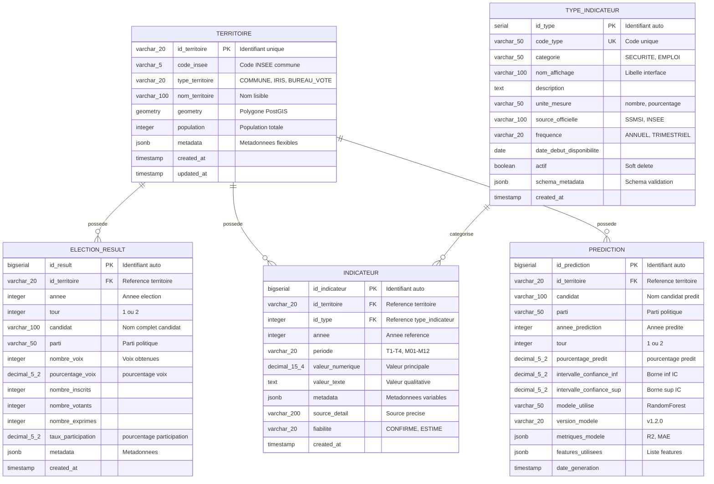

# Modèle Conceptuel de Données (MCD)

**Version :** 2.0
**Architecture :** Scalable (Pattern EAV Hybride)

---

## Vue d'Ensemble

Le MCD structure les données nécessaires à la prédiction des tendances électorales en croisant :
- **Résultats électoraux** (Présidentielles 2017 & 2022)
- **Indicateurs socio-économiques** (Sécurité, Emploi, Démographie)
- **Référentiel géographique** (IRIS, Bureaux de vote, Communes)

---

## Diagramme Entité-Association

### Notation Crow's Foot (Mermaid ERD)



**Légende des cardinalités :**
- `||--o{` : 1 à plusieurs (One-to-Many)
- `||` : Exactement 1 (obligatoire)
- `o{` : 0 à plusieurs (optionnel côté "many")

---

## Entités

### 1. TERRITOIRE (Référentiel Géographique)

**Description :** Entité centrale représentant les divisions géographiques (IRIS, Bureaux de vote, Communes, Arrondissements).

**Attributs clés :**
- `id_territoire` : Identifiant unique (ex: `'33063'`, `'IRIS_330630101'`)
- `type_territoire` : Type géographique (`COMMUNE`, `IRIS`, `BUREAU_VOTE`, `ARRONDISSEMENT`)
- `geometry` : Polygone géospatial (PostGIS)
- `population` : Population totale

**Rôle :** Point d'ancrage pour toutes les données (élections, indicateurs, prédictions).

---

### 2. TYPE_INDICATEUR (Catalogue)

**Description :** Catalogue référençant tous les types d'indicateurs socio-économiques disponibles.

**Attributs clés :**
- `id_type` : Identifiant auto-incrémenté
- `code_type` : Code unique (ex: `'SECURITE_CAMBRIOLAGES'`, `'EMPLOI_TAUX_CHOMAGE'`)
- `categorie` : Catégorie macro (`SECURITE`, `EMPLOI`, `DEMOGRAPHIE`)
- `source_officielle` : Organisme source (`SSMSI`, `INSEE`)
- `actif` : Indicateur actif (soft delete)

**Rôle :** Documentation centralisée des sources de données.

**Exemple de données :**
| id_type | code_type | categorie | nom_affichage | source |
|---------|-----------|-----------|---------------|--------|
| 1 | `SECURITE_CAMBRIOLAGES` | SECURITE | Cambriolages de logement | SSMSI |
| 2 | `EMPLOI_TAUX_CHOMAGE` | EMPLOI | Taux de chômage | INSEE |

---

### 3. INDICATEUR (Table Générique)

**Description :** Table générique stockant TOUS les indicateurs socio-économiques (Pattern EAV).

**Attributs clés :**
- `id_indicateur` : Identifiant auto-incrémenté
- `id_territoire` : FK → TERRITOIRE
- `id_type` : FK → TYPE_INDICATEUR
- `annee` : Année de référence
- `periode` : Période infra-annuelle (`T1`, `M03`, `NULL`)
- `valeur_numerique` : Valeur principale (nombre, pourcentage, euros)
- `metadata` : Métadonnées JSONB variables selon type

**Rôle :** Centraliser tous les indicateurs dans une seule table extensible.

**Avantages :**
- ✅ Ajout nouvelle source = 1 INSERT dans `type_indicateur`
- ✅ JSONB flexible pour métadonnées variables
- ✅ 1 seule table à joindre (vs N tables par indicateur)

---

### 4. ELECTION_RESULT (Table Spécialisée)

**Description :** Résultats électoraux présidentielles 2017 & 2022 (1er et 2nd tours).

**Attributs clés :**
- `id_result` : Identifiant auto-incrémenté
- `id_territoire` : FK → TERRITOIRE
- `annee` : Année élection (2017, 2022)
- `tour` : Tour (1 ou 2)
- `candidat` : Nom complet candidat
- `nombre_voix` : Voix obtenues
- `pourcentage_voix` : % voix exprimées
- `taux_participation` : % participation

**Rôle :** Données électorales historiques (variable cible pour ML).

**Pourquoi table spécialisée ?**
- ✅ Volume élevé (milliers de lignes par élection)
- ✅ Schéma stable (colonnes fixes connues)
- ✅ Requêtes fréquentes et complexes

---

### 5. PREDICTION (Output ML)

**Description :** Prédictions électorales 2027 générées par les modèles Machine Learning.

**Attributs clés :**
- `id_prediction` : Identifiant auto-incrémenté
- `id_territoire` : FK → TERRITOIRE
- `candidat` : Nom candidat prédit
- `pourcentage_predit` : % voix prédit
- `intervalle_confiance_inf/sup` : Bornes IC 95%
- `modele_utilise` : Nom modèle (`RandomForest`, `XGBoost`)
- `metriques_modele` : Métriques performance (JSONB)

**Rôle :** Stocker les prédictions avec traçabilité complète (modèle, version, métriques).

---

## Relations et Cardinalités

### Relation 1 : TERRITOIRE ↔ ELECTION_RESULT

- **Type :** 1:N (One-to-Many)
- **Description :** Un territoire possède plusieurs résultats électoraux (différentes années, tours, candidats)
- **Cardinalité :**
  - 1 territoire → 0..N résultats
  - 1 résultat → 1 territoire (obligatoire)
- **Clé étrangère :** `election_result.id_territoire` → `territoire.id_territoire`
- **Intégrité :** ON DELETE CASCADE

**Exemple :**
- Territoire `'33063'` (Bordeaux) → 50 résultats (2 années × 2 tours × ~12 candidats)

---

### Relation 2 : TERRITOIRE ↔ INDICATEUR

- **Type :** 1:N (One-to-Many)
- **Description :** Un territoire possède plusieurs indicateurs (différents types, années, périodes)
- **Cardinalité :**
  - 1 territoire → 0..N indicateurs
  - 1 indicateur → 1 territoire (obligatoire)
- **Clé étrangère :** `indicateur.id_territoire` → `territoire.id_territoire`
- **Intégrité :** ON DELETE CASCADE

**Exemple :**
- Territoire `'33063'` → 1000 indicateurs (20 types × 8 années × ~6 périodes)

---

### Relation 3 : TYPE_INDICATEUR ↔ INDICATEUR

- **Type :** 1:N (One-to-Many)
- **Description :** Un type d'indicateur est utilisé par plusieurs indicateurs
- **Cardinalité :**
  - 1 type → 0..N indicateurs
  - 1 indicateur → 1 type (obligatoire)
- **Clé étrangère :** `indicateur.id_type` → `type_indicateur.id_type`
- **Intégrité :** ON DELETE RESTRICT (impossible supprimer type si indicateurs existent)

**Exemple :**
- Type `'SECURITE_CAMBRIOLAGES'` → 500 indicateurs (130 territoires × ~4 années)

---

### Relation 4 : TERRITOIRE ↔ PREDICTION

- **Type :** 1:N (One-to-Many)
- **Description :** Un territoire possède plusieurs prédictions (différents candidats, tours, versions modèle)
- **Cardinalité :**
  - 1 territoire → 0..N prédictions
  - 1 prédiction → 1 territoire (obligatoire)
- **Clé étrangère :** `prediction.id_territoire` → `territoire.id_territoire`
- **Intégrité :** ON DELETE CASCADE

**Exemple :**
- Territoire `'IRIS_330630101'` → 20 prédictions (2 tours × ~10 candidats)

---

## Pattern Architectural : EAV Hybride

### Principe

L'architecture combine :
1. **Tables spécialisées** pour données structurées à fort volume (`election_result`)
2. **Table générique** pour données variables (`indicateur` - Pattern EAV)
3. **JSONB** pour métadonnées flexibles

### Avantages

| Aspect | Avantage |
|--------|----------|
| **Extensibilité** | Ajout nouvelle source sans ALTER TABLE |
| **Flexibilité** | Métadonnées variables par type |
| **Maintenabilité** | 1 table au lieu de N tables par indicateur |
| **Performance** | Indexation optimisée (GIN sur JSONB) |

### Trade-offs

| Inconvénient | Mitigation |
|--------------|------------|
| Requêtes nécessitent filtrage par `id_type` | Index composites optimisés |
| Validation schéma JSONB en applicatif | Schéma de référence dans `type_indicateur.schema_metadata` |

---

## Dépendances Fonctionnelles

### Table TERRITOIRE
```
id_territoire → code_insee, type_territoire, nom_territoire, geometry, population
```

### Table ELECTION_RESULT
```
id_result → id_territoire, annee, tour, candidat, parti, nombre_voix, ...
(id_territoire, annee, tour, candidat) → UNIQUE (contrainte)
```

### Table INDICATEUR
```
id_indicateur → id_territoire, id_type, annee, periode, valeur_numerique, ...
(id_territoire, id_type, annee, periode) → UNIQUE (contrainte)
```

---

## Normalisation

**Forme Normale :** 3FN (Troisième Forme Normale)

### Vérification 1FN (Première Forme Normale)
- ✅ Toutes les valeurs sont atomiques (pas de listes, pas de multivalués)
- ✅ Pas de groupes répétitifs

### Vérification 2FN (Deuxième Forme Normale)
- ✅ Tous les attributs non-clés dépendent de la totalité de la clé primaire
- ✅ Pas de dépendances partielles

### Vérification 3FN (Troisième Forme Normale)
- ✅ Pas de dépendances transitives
- ✅ Séparation des catalogues (`type_indicateur`) des données (`indicateur`)

---

## Volumétrie Estimée (POC Bordeaux)

| Entité | Lignes Estimées | Justification |
|--------|-----------------|---------------|
| `territoire` | ~130 | 50 IRIS + 80 bureaux de vote |
| `type_indicateur` | ~50 | 13 sécurité + 4 emploi + autres |
| `indicateur` | ~15 000 | 130 territoires × 20 types × ~6 années |
| `election_result` | ~6 500 | 130 territoires × 2 années × 2 tours × 12 candidats |
| `prediction` | ~2 600 | 130 territoires × 2 tours × 10 candidats |
| **TOTAL** | **~24 300** | |

---

**Prochaine étape :** Consulter le [Modèle Logique de Données (MLD)](02-mld.md) pour le schéma relationnel détaillé.
