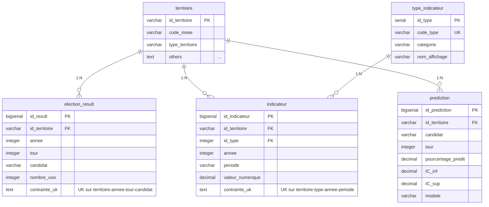

# Modèle Logique de Données (MLD)

**Version :** 2.0
**Date :** 2026-02-10
**Auteur :** @tech
**Statut :** Production-Ready

---

## Vue d'Ensemble

Le Modèle Logique de Données (MLD) traduit le [MCD](01-mcd.md) en schéma relationnel normalisé (3FN) prêt pour l'implémentation PostgreSQL.

**Notation utilisée :**
- **PK** : Primary Key (Clé Primaire)
- **FK** : Foreign Key (Clé Étrangère)
- **UK** : Unique Key (Contrainte d'unicité)
- **CK** : Check Constraint (Contrainte de domaine)

---

## Schéma Relationnel Normalisé

### Table 1 : `territoire`

#### Description
Référentiel géographique centralisant les divisions territoriales (IRIS, Bureaux de vote, Communes, Arrondissements).

#### Schéma Formel
```
TERRITOIRE (id_territoire, code_insee, type_territoire, nom_territoire,
            geometry, population, metadata, created_at, updated_at)
    PK : id_territoire
    UK : AUCUNE
    CK : type_territoire ∈ {'COMMUNE', 'IRIS', 'BUREAU_VOTE', 'ARRONDISSEMENT'}
    CK : population ≥ 0
```

#### Définition SQL
```sql
CREATE TABLE territoire (
    id_territoire       VARCHAR(20)     PRIMARY KEY,
    code_insee          VARCHAR(5)      NOT NULL,
    type_territoire     VARCHAR(20)     NOT NULL CHECK (type_territoire IN (
                                                    'COMMUNE',
                                                    'IRIS',
                                                    'BUREAU_VOTE',
                                                    'ARRONDISSEMENT'
                                                )),
    nom_territoire      VARCHAR(100)    NOT NULL,
    geometry            GEOMETRY(POLYGON, 4326),
    population          INTEGER         CHECK (population >= 0),
    metadata            JSONB,
    created_at          TIMESTAMP       DEFAULT NOW(),
    updated_at          TIMESTAMP       DEFAULT NOW()
);
```

#### Exemples de données
| id_territoire | code_insee | type_territoire | nom_territoire | population |
|---------------|------------|-----------------|----------------|------------|
| `33063` | `33063` | COMMUNE | Bordeaux | 252040 |
| `IRIS_330630101` | `33063` | IRIS | Bordeaux Centre IRIS 0101 | 5000 |
| `BV_33063_001` | `33063` | BUREAU_VOTE | Bureau de vote 001 | 800 |

---

### Table 2 : `type_indicateur`

#### Description
Catalogue référençant tous les types d'indicateurs socio-économiques disponibles. Table de référence pour le pattern EAV.

#### Schéma Formel
```
TYPE_INDICATEUR (id_type, code_type, categorie, nom_affichage, description,
                 unite_mesure, source_officielle, frequence,
                 date_debut_disponibilite, actif, schema_metadata, created_at)
    PK : id_type
    UK : code_type
    CK : AUCUNE
```

#### Définition SQL
```sql
CREATE TABLE type_indicateur (
    id_type                     SERIAL          PRIMARY KEY,
    code_type                   VARCHAR(50)     NOT NULL UNIQUE,
    categorie                   VARCHAR(50)     NOT NULL,
    nom_affichage               VARCHAR(100)    NOT NULL,
    description                 TEXT,
    unite_mesure                VARCHAR(50),
    source_officielle           VARCHAR(100),
    frequence                   VARCHAR(20),
    date_debut_disponibilite    DATE,
    actif                       BOOLEAN         DEFAULT TRUE,
    schema_metadata             JSONB,
    created_at                  TIMESTAMP       DEFAULT NOW()
);
```

#### Exemples de données
| id_type | code_type | categorie | nom_affichage | unite_mesure | source |
|---------|-----------|-----------|---------------|--------------|--------|
| 1 | `SECURITE_CAMBRIOLAGES` | SECURITE | Cambriolages de logement | nombre | SSMSI |
| 2 | `EMPLOI_TAUX_CHOMAGE` | EMPLOI | Taux de chômage | pourcentage | INSEE |
| 3 | `DEMO_POPULATION` | DEMOGRAPHIE | Population totale | nombre | INSEE |

---

### Table 3 : `indicateur`

#### Description
Table générique stockant TOUS les indicateurs socio-économiques (Pattern EAV). Permet l'ajout de nouvelles sources sans modification de schéma.

#### Schéma Formel
```
INDICATEUR (id_indicateur, id_territoire, id_type, annee, periode,
            valeur_numerique, valeur_texte, metadata, source_detail,
            fiabilite, created_at)
    PK : id_indicateur
    FK : id_territoire → TERRITOIRE(id_territoire) ON DELETE CASCADE
    FK : id_type → TYPE_INDICATEUR(id_type) ON DELETE RESTRICT
    UK : (id_territoire, id_type, annee, periode)
    CK : annee ∈ [2000, 2100]
    CK : fiabilite ∈ {'CONFIRME', 'ESTIME', 'PROVISOIRE', 'REVISION'}
```

#### Définition SQL
```sql
CREATE TABLE indicateur (
    id_indicateur       BIGSERIAL       PRIMARY KEY,
    id_territoire       VARCHAR(20)     NOT NULL,
    id_type             INTEGER         NOT NULL,
    annee               INTEGER         NOT NULL CHECK (annee BETWEEN 2000 AND 2100),
    periode             VARCHAR(20),
    valeur_numerique    DECIMAL(15,4),
    valeur_texte        TEXT,
    metadata            JSONB,
    source_detail       VARCHAR(200),
    fiabilite           VARCHAR(20)     DEFAULT 'CONFIRME'
                                        CHECK (fiabilite IN (
                                            'CONFIRME',
                                            'ESTIME',
                                            'PROVISOIRE',
                                            'REVISION'
                                        )),
    created_at          TIMESTAMP       DEFAULT NOW(),

    FOREIGN KEY (id_territoire) REFERENCES territoire(id_territoire)
        ON DELETE CASCADE
        ON UPDATE CASCADE,
    FOREIGN KEY (id_type) REFERENCES type_indicateur(id_type)
        ON DELETE RESTRICT
        ON UPDATE CASCADE,
    UNIQUE (id_territoire, id_type, annee, periode)
);
```

#### Exemples de données
| id_indicateur | id_territoire | id_type | annee | periode | valeur_numerique | fiabilite |
|---------------|---------------|---------|-------|---------|------------------|-----------|
| 1 | `33063` | 1 | 2022 | NULL | 504.0 | CONFIRME |
| 2 | `33063` | 2 | 2022 | T1 | 8.5 | ESTIME |
| 3 | `IRIS_330630101` | 3 | 2021 | NULL | 5000.0 | CONFIRME |

---

### Table 4 : `election_result`

#### Description
Résultats électoraux présidentielles 2017 & 2022 (1er et 2nd tours). Table spécialisée pour performance et intégrité.

#### Schéma Formel
```
ELECTION_RESULT (id_result, id_territoire, annee, tour, candidat, parti,
                 nombre_voix, pourcentage_voix, nombre_inscrits,
                 nombre_votants, nombre_exprimes, taux_participation,
                 metadata, created_at)
    PK : id_result
    FK : id_territoire → TERRITOIRE(id_territoire) ON DELETE CASCADE
    UK : (id_territoire, annee, tour, candidat)
    CK : tour ∈ {1, 2}
    CK : annee ∈ [2000, 2100]
    CK : pourcentage_voix ∈ [0, 100]
    CK : taux_participation ∈ [0, 100]
    CK : nombre_voix ≥ 0
    CK : nombre_inscrits ≥ 0
    CK : nombre_votants ≥ 0
    CK : nombre_exprimes ≥ 0
```

#### Définition SQL
```sql
CREATE TABLE election_result (
    id_result               BIGSERIAL       PRIMARY KEY,
    id_territoire           VARCHAR(20)     NOT NULL,
    annee                   INTEGER         NOT NULL CHECK (annee BETWEEN 2000 AND 2100),
    tour                    INTEGER         NOT NULL CHECK (tour IN (1, 2)),
    candidat                VARCHAR(100)    NOT NULL,
    parti                   VARCHAR(50),
    nombre_voix             INTEGER         NOT NULL CHECK (nombre_voix >= 0),
    pourcentage_voix        DECIMAL(5,2)    NOT NULL CHECK (pourcentage_voix BETWEEN 0 AND 100),
    nombre_inscrits         INTEGER         NOT NULL CHECK (nombre_inscrits >= 0),
    nombre_votants          INTEGER         NOT NULL CHECK (nombre_votants >= 0),
    nombre_exprimes         INTEGER         NOT NULL CHECK (nombre_exprimes >= 0),
    taux_participation      DECIMAL(5,2)    NOT NULL CHECK (taux_participation BETWEEN 0 AND 100),
    metadata                JSONB,
    created_at              TIMESTAMP       DEFAULT NOW(),

    FOREIGN KEY (id_territoire) REFERENCES territoire(id_territoire)
        ON DELETE CASCADE
        ON UPDATE CASCADE,
    UNIQUE (id_territoire, annee, tour, candidat)
);
```

#### Exemples de données
| id_result | id_territoire | annee | tour | candidat | parti | nombre_voix | pourcentage_voix | taux_participation |
|-----------|---------------|-------|------|----------|-------|-------------|------------------|--------------------|
| 1 | `BV_33063_001` | 2022 | 1 | Emmanuel MACRON | LREM | 450 | 28.45 | 75.33 |
| 2 | `BV_33063_001` | 2022 | 1 | Marine LE PEN | RN | 320 | 20.22 | 75.33 |
| 3 | `BV_33063_001` | 2022 | 2 | Emmanuel MACRON | LREM | 625 | 58.74 | 78.50 |

---

### Table 5 : `prediction`

#### Description
Prédictions électorales 2027 générées par les modèles Machine Learning. Traçabilité complète (modèle, version, métriques).

#### Schéma Formel
```
PREDICTION (id_prediction, id_territoire, candidat, parti, annee_prediction,
            tour, pourcentage_predit, intervalle_confiance_inf,
            intervalle_confiance_sup, modele_utilise, version_modele,
            metriques_modele, features_utilisees, date_generation)
    PK : id_prediction
    FK : id_territoire → TERRITOIRE(id_territoire) ON DELETE CASCADE
    UK : (id_territoire, candidat, tour, annee_prediction, version_modele)
    CK : tour ∈ {1, 2}
    CK : annee_prediction ∈ [2025, 2050]
    CK : pourcentage_predit ∈ [0, 100]
    CK : intervalle_confiance_inf ∈ [0, 100]
    CK : intervalle_confiance_sup ∈ [0, 100]
```

#### Définition SQL
```sql
CREATE TABLE prediction (
    id_prediction               BIGSERIAL       PRIMARY KEY,
    id_territoire               VARCHAR(20)     NOT NULL,
    candidat                    VARCHAR(100)    NOT NULL,
    parti                       VARCHAR(50),
    annee_prediction            INTEGER         CHECK (annee_prediction BETWEEN 2025 AND 2050),
    tour                        INTEGER         NOT NULL CHECK (tour IN (1, 2)),
    pourcentage_predit          DECIMAL(5,2)    NOT NULL CHECK (pourcentage_predit BETWEEN 0 AND 100),
    intervalle_confiance_inf    DECIMAL(5,2)    CHECK (intervalle_confiance_inf BETWEEN 0 AND 100),
    intervalle_confiance_sup    DECIMAL(5,2)    CHECK (intervalle_confiance_sup BETWEEN 0 AND 100),
    modele_utilise              VARCHAR(50)     NOT NULL,
    version_modele              VARCHAR(20),
    metriques_modele            JSONB,
    features_utilisees          JSONB,
    date_generation             TIMESTAMP       DEFAULT NOW(),

    FOREIGN KEY (id_territoire) REFERENCES territoire(id_territoire)
        ON DELETE CASCADE
        ON UPDATE CASCADE,
    UNIQUE (id_territoire, candidat, tour, annee_prediction, version_modele)
);
```

#### Exemples de données
| id_prediction | id_territoire | candidat | tour | pourcentage_predit | IC_inf | IC_sup | modele_utilise | version |
|---------------|---------------|----------|------|--------------------|--------|--------|----------------|---------|
| 1 | `IRIS_330630101` | Emmanuel MACRON | 1 | 32.15 | 29.80 | 34.50 | RandomForest | v1.2.0 |
| 2 | `IRIS_330630101` | Marine LE PEN | 1 | 25.30 | 23.10 | 27.50 | RandomForest | v1.2.0 |

---

## Diagramme Relationnel



---

## Dépendances Fonctionnelles

### Table `territoire`
```
id_territoire → code_insee, type_territoire, nom_territoire, geometry, population, metadata
```
- **Clé candidate :** `id_territoire`
- **Forme normale :** 3FN

### Table `type_indicateur`
```
id_type → code_type, categorie, nom_affichage, description, ...
code_type → id_type, categorie, nom_affichage, ...
```
- **Clés candidates :** `id_type`, `code_type`
- **Forme normale :** 3FN

### Table `indicateur`
```
id_indicateur → id_territoire, id_type, annee, periode, valeur_numerique, ...
(id_territoire, id_type, annee, periode) → valeur_numerique, valeur_texte, metadata, ...
```
- **Clé primaire :** `id_indicateur`
- **Clé candidate alternative :** `(id_territoire, id_type, annee, periode)`
- **Forme normale :** 3FN

### Table `election_result`
```
id_result → id_territoire, annee, tour, candidat, parti, nombre_voix, ...
(id_territoire, annee, tour, candidat) → parti, nombre_voix, pourcentage_voix, ...
```
- **Clé primaire :** `id_result`
- **Clé candidate alternative :** `(id_territoire, annee, tour, candidat)`
- **Forme normale :** 3FN

### Table `prediction`
```
id_prediction → id_territoire, candidat, parti, tour, annee_prediction, ...
(id_territoire, candidat, tour, annee_prediction, version_modele) → pourcentage_predit, IC_inf, IC_sup, ...
```
- **Clé primaire :** `id_prediction`
- **Clé candidate alternative :** `(id_territoire, candidat, tour, annee_prediction, version_modele)`
- **Forme normale :** 3FN

---

## Contraintes d'Intégrité Référentielle

### Cascade ON DELETE (Propagation Suppression)

| Table Enfant | Colonne FK | Table Parent | Justification |
|--------------|------------|--------------|---------------|
| `indicateur` | `id_territoire` | `territoire` | Suppression territoire → suppression indicateurs associés |
| `election_result` | `id_territoire` | `territoire` | Suppression territoire → suppression résultats associés |
| `prediction` | `id_territoire` | `territoire` | Suppression territoire → suppression prédictions associées |

### RESTRICT ON DELETE (Blocage Suppression)

| Table Enfant | Colonne FK | Table Parent | Justification |
|--------------|------------|--------------|---------------|
| `indicateur` | `id_type` | `type_indicateur` | Impossible supprimer un type tant qu'il est utilisé |

**Alternative :** Utiliser colonne `actif` dans `type_indicateur` pour soft delete.

---

## Indexation (Aperçu)

Voir [Index et Optimisation](06-index-optimisation.md) pour détails complets.

| Table | Index Principaux | Usage |
|-------|------------------|-------|
| `territoire` | `(code_insee)`, `(type_territoire)`, `(geometry)` | Recherche, filtrage, spatial |
| `type_indicateur` | `(code_type)`, `(categorie)` | Recherche catalogue |
| `indicateur` | `(id_territoire, id_type, annee)`, `(metadata)` | Requêtes ML, JSONB |
| `election_result` | `(id_territoire, annee, tour)`, `(candidat)` | Requêtes électorales |
| `prediction` | `(id_territoire)`, `(annee_prediction)` | Filtrage prédictions |

---

## Volumétrie Estimée (POC Bordeaux)

| Table | Lignes | Taille | Croissance |
|-------|--------|--------|------------|
| `territoire` | ~130 | <1 KB | Stable |
| `type_indicateur` | ~50 | <10 KB | +5-10/an |
| `indicateur` | ~15 000 | ~2 MB | +1000/an |
| `election_result` | ~6 500 | ~1 MB | +3000/élection |
| `prediction` | ~2 600 | ~500 KB | +1300/modèle |
| **TOTAL** | **~24 300** | **~4 MB** | - |

---

**Prochaine étape :** Consulter le [Dictionnaire de Données](03-dictionnaire-donnees.md) pour description exhaustive de chaque colonne.
