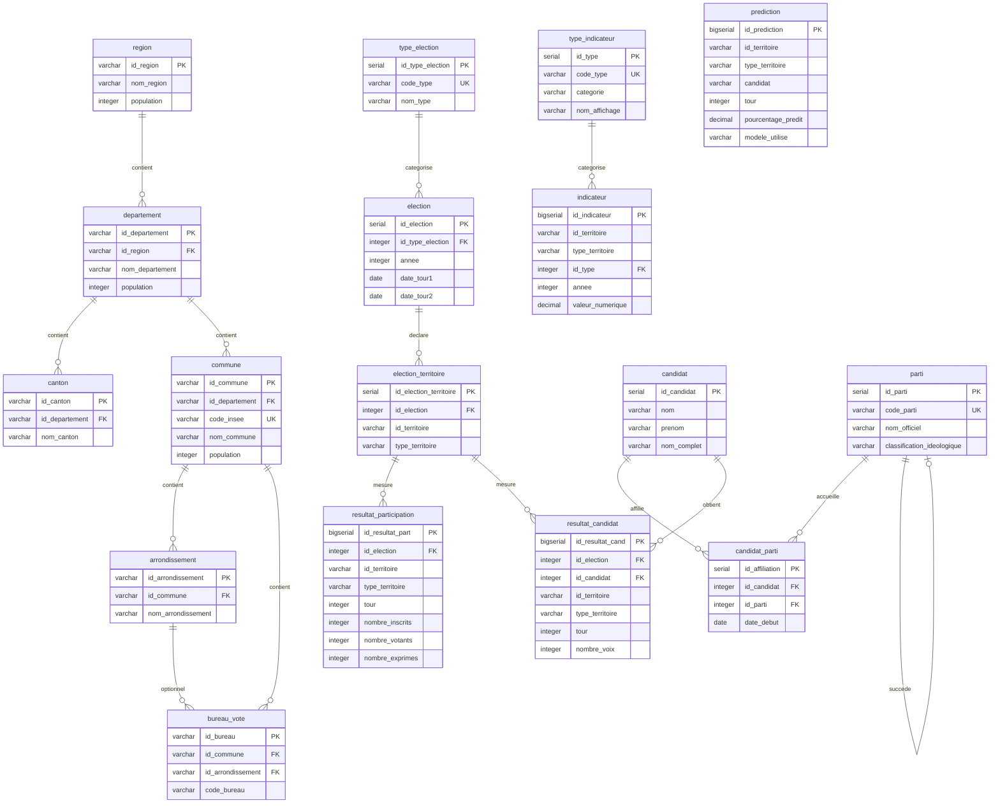

# Modele Logique de Donnees (MLD)

**Version :** 3.0
**Date :** 2026-02-12
**Auteur :** @tech
**Statut :** Production-Ready

---

## Vue d'Ensemble

Le MLD v3.0 traduit le [MCD](01-mcd.md) en schema relationnel normalise (3FN) avec **17 tables** reparties en 6 domaines.

**Notation :**
- **PK** : Primary Key
- **FK** : Foreign Key
- **UK** : Unique Key
- **CK** : Check Constraint

**Specificite v3.0 :** Systeme polymorphe `(id_territoire, type_territoire)` pour lier les resultats et indicateurs a n'importe quel niveau de la hierarchie geographique.

---

## Diagramme Relationnel



---

## Schema Formel par Table

### 1. Hierarchie Geographique

#### `region`

```
REGION (id_region, code_insee, nom_region, population, created_at)
    PK : id_region
```

```sql
CREATE TABLE region (
    id_region       VARCHAR(2)      PRIMARY KEY,
    code_insee      VARCHAR(2)      NOT NULL,
    nom_region      VARCHAR(100)    NOT NULL,
    population      INTEGER,
    created_at      TIMESTAMP       NOT NULL DEFAULT NOW()
);
```

---

#### `departement`

```
DEPARTEMENT (id_departement, id_region, code_insee, nom_departement,
             population, chef_lieu, created_at)
    PK : id_departement
    FK : id_region -> REGION(id_region) ON DELETE CASCADE
```

```sql
CREATE TABLE departement (
    id_departement  VARCHAR(3)      PRIMARY KEY,
    id_region       VARCHAR(2)      NOT NULL,
    code_insee      VARCHAR(3)      NOT NULL,
    nom_departement VARCHAR(100)    NOT NULL,
    population      INTEGER,
    chef_lieu       VARCHAR(5),
    created_at      TIMESTAMP       NOT NULL DEFAULT NOW(),

    FOREIGN KEY (id_region) REFERENCES region(id_region) ON DELETE CASCADE
);
CREATE INDEX idx_departement_region ON departement(id_region);
```

---

#### `commune`

```
COMMUNE (id_commune, id_departement, code_insee, nom_commune,
         population, superficie_km2, created_at, updated_at)
    PK : id_commune
    FK : id_departement -> DEPARTEMENT(id_departement) ON DELETE CASCADE
    UK : code_insee
```

```sql
CREATE TABLE commune (
    id_commune      VARCHAR(5)      PRIMARY KEY,
    id_departement  VARCHAR(3)      NOT NULL,
    code_insee      VARCHAR(5)      NOT NULL UNIQUE,
    nom_commune     VARCHAR(100)    NOT NULL,
    population      INTEGER,
    superficie_km2  NUMERIC(10,2),
    created_at      TIMESTAMP       NOT NULL DEFAULT NOW(),
    updated_at      TIMESTAMP       NOT NULL DEFAULT NOW(),

    FOREIGN KEY (id_departement) REFERENCES departement(id_departement) ON DELETE CASCADE
);
CREATE INDEX idx_commune_departement ON commune(id_departement);
CREATE UNIQUE INDEX idx_commune_code_insee ON commune(code_insee);
```

---

#### `canton`

```
CANTON (id_canton, id_departement, code_canton, numero_canton,
        nom_canton, population, created_at)
    PK : id_canton
    FK : id_departement -> DEPARTEMENT(id_departement) ON DELETE CASCADE
```

```sql
CREATE TABLE canton (
    id_canton       VARCHAR(10)     PRIMARY KEY,
    id_departement  VARCHAR(3)      NOT NULL,
    code_canton     VARCHAR(10)     NOT NULL,
    numero_canton   INTEGER,
    nom_canton      VARCHAR(100)    NOT NULL,
    population      INTEGER,
    created_at      TIMESTAMP       NOT NULL DEFAULT NOW(),

    FOREIGN KEY (id_departement) REFERENCES departement(id_departement) ON DELETE CASCADE
);
CREATE INDEX idx_canton_departement ON canton(id_departement);
```

---

#### `arrondissement`

```
ARRONDISSEMENT (id_arrondissement, id_commune, numero_arrondissement,
                nom_arrondissement, population, created_at)
    PK : id_arrondissement
    FK : id_commune -> COMMUNE(id_commune) ON DELETE CASCADE
```

```sql
CREATE TABLE arrondissement (
    id_arrondissement       VARCHAR(10)     PRIMARY KEY,
    id_commune              VARCHAR(5)      NOT NULL,
    numero_arrondissement   INTEGER,
    nom_arrondissement      VARCHAR(100),
    population              INTEGER,
    created_at              TIMESTAMP       NOT NULL DEFAULT NOW(),

    FOREIGN KEY (id_commune) REFERENCES commune(id_commune) ON DELETE CASCADE
);
CREATE INDEX idx_arrondissement_commune ON arrondissement(id_commune);
```

---

#### `bureau_vote`

```
BUREAU_VOTE (id_bureau, id_commune, id_arrondissement, code_bureau,
             nom_bureau, adresse, nombre_inscrits, created_at, updated_at)
    PK : id_bureau
    FK : id_commune -> COMMUNE(id_commune) ON DELETE CASCADE
    FK : id_arrondissement -> ARRONDISSEMENT(id_arrondissement) ON DELETE SET NULL
    UK : (id_commune, code_bureau)
```

```sql
CREATE TABLE bureau_vote (
    id_bureau           VARCHAR(15)     PRIMARY KEY,
    id_commune          VARCHAR(5)      NOT NULL,
    id_arrondissement   VARCHAR(10),
    code_bureau         VARCHAR(10)     NOT NULL,
    nom_bureau          VARCHAR(200),
    adresse             TEXT,
    nombre_inscrits     INTEGER,
    created_at          TIMESTAMP       NOT NULL DEFAULT NOW(),
    updated_at          TIMESTAMP       NOT NULL DEFAULT NOW(),

    FOREIGN KEY (id_commune) REFERENCES commune(id_commune) ON DELETE CASCADE,
    FOREIGN KEY (id_arrondissement) REFERENCES arrondissement(id_arrondissement) ON DELETE SET NULL,
    UNIQUE (id_commune, code_bureau)
);
CREATE INDEX idx_bureau_commune ON bureau_vote(id_commune);
CREATE INDEX idx_bureau_arrondissement ON bureau_vote(id_arrondissement);
```

---

### 2. References Electorales

#### `type_election`

```
TYPE_ELECTION (id_type_election, code_type, nom_type, mode_scrutin,
               niveau_geographique, description, created_at)
    PK : id_type_election
    UK : code_type
    CK : code_type IN ('PRES', 'LEG', 'MUN', 'EUR', 'REG', 'DEP', 'SENAT')
```

```sql
CREATE TABLE type_election (
    id_type_election    SERIAL          PRIMARY KEY,
    code_type           VARCHAR(20)     NOT NULL UNIQUE
                                        CHECK (code_type IN ('PRES','LEG','MUN','EUR','REG','DEP','SENAT')),
    nom_type            VARCHAR(100)    NOT NULL,
    mode_scrutin        VARCHAR(50),
    niveau_geographique VARCHAR(50),
    description         TEXT,
    created_at          TIMESTAMP       NOT NULL DEFAULT NOW()
);
CREATE UNIQUE INDEX idx_type_election_code ON type_election(code_type);
```

---

#### `election`

```
ELECTION (id_election, id_type_election, annee, date_tour1, date_tour2,
          nombre_tours, contexte, metadata_, created_at)
    PK : id_election
    FK : id_type_election -> TYPE_ELECTION(id_type_election) ON DELETE CASCADE
    UK : (id_type_election, annee, date_tour1)
    CK : annee IN [1900, 2100]
    CK : nombre_tours IN (1, 2)
    CK : date_tour2 IS NULL OR date_tour2 > date_tour1
```

```sql
CREATE TABLE election (
    id_election         SERIAL          PRIMARY KEY,
    id_type_election    INTEGER         NOT NULL,
    annee               INTEGER         NOT NULL CHECK (annee BETWEEN 1900 AND 2100),
    date_tour1          DATE            NOT NULL,
    date_tour2          DATE,
    nombre_tours        INTEGER         NOT NULL DEFAULT 1 CHECK (nombre_tours IN (1, 2)),
    contexte            TEXT,
    metadata_           JSON,
    created_at          TIMESTAMP       NOT NULL DEFAULT NOW(),

    FOREIGN KEY (id_type_election) REFERENCES type_election(id_type_election) ON DELETE CASCADE,
    UNIQUE (id_type_election, annee, date_tour1),
    CHECK (date_tour2 IS NULL OR date_tour2 > date_tour1)
);
CREATE INDEX idx_election_annee ON election(annee);
CREATE INDEX idx_election_type ON election(id_type_election);
```

---

### 3. References Politiques

#### `parti`

```
PARTI (id_parti, code_parti, nom_officiel, nom_court, classification_ideologique,
       position_economique, position_sociale, couleur_hex, logo_url,
       date_creation, date_dissolution, successeur_id, metadata_, created_at)
    PK : id_parti
    UK : code_parti
    FK : successeur_id -> PARTI(id_parti) ON DELETE SET NULL
    CK : position_economique IN [-1.0, 1.0]
    CK : position_sociale IN [-1.0, 1.0]
    CK : classification_ideologique IN (...)
    CK : date_dissolution IS NULL OR date_dissolution >= date_creation
```

```sql
CREATE TABLE parti (
    id_parti                    SERIAL          PRIMARY KEY,
    code_parti                  VARCHAR(20)     NOT NULL UNIQUE,
    nom_officiel                VARCHAR(200)    NOT NULL,
    nom_court                   VARCHAR(100),
    classification_ideologique  VARCHAR(50)
        CHECK (classification_ideologique IN (
            'extreme_gauche','gauche','centre_gauche','centre',
            'centre_droit','droite','extreme_droite','autre'
        )),
    position_economique         NUMERIC(3,2)    CHECK (position_economique BETWEEN -1.0 AND 1.0),
    position_sociale            NUMERIC(3,2)    CHECK (position_sociale BETWEEN -1.0 AND 1.0),
    couleur_hex                 VARCHAR(7),
    logo_url                    VARCHAR(500),
    date_creation               DATE,
    date_dissolution            DATE,
    successeur_id               INTEGER,
    metadata_                   JSON,
    created_at                  TIMESTAMP       NOT NULL DEFAULT NOW(),

    FOREIGN KEY (successeur_id) REFERENCES parti(id_parti) ON DELETE SET NULL,
    CHECK (date_dissolution IS NULL OR date_dissolution >= date_creation)
);
CREATE INDEX idx_parti_classification ON parti(classification_ideologique);
```

---

#### `candidat`

```
CANDIDAT (id_candidat, nom, prenom, nom_complet, date_naissance,
          profession, biographie, photo_url, metadata_, created_at)
    PK : id_candidat
    CK : date_naissance IS NULL OR date_naissance <= CURRENT_DATE
```

```sql
CREATE TABLE candidat (
    id_candidat     SERIAL          PRIMARY KEY,
    nom             VARCHAR(100)    NOT NULL,
    prenom          VARCHAR(100)    NOT NULL,
    nom_complet     VARCHAR(200)    NOT NULL,  -- Computed: prenom || ' ' || nom
    date_naissance  DATE            CHECK (date_naissance IS NULL OR date_naissance <= CURRENT_DATE),
    profession      VARCHAR(200),
    biographie      TEXT,
    photo_url       VARCHAR(500),
    metadata_       JSON,
    created_at      TIMESTAMP       NOT NULL DEFAULT NOW()
);
CREATE INDEX idx_candidat_nom_complet ON candidat(nom_complet);
```

---

#### `candidat_parti`

```
CANDIDAT_PARTI (id_affiliation, id_candidat, id_parti, date_debut,
                date_fin, fonction, created_at)
    PK : id_affiliation
    FK : id_candidat -> CANDIDAT(id_candidat) ON DELETE CASCADE
    FK : id_parti -> PARTI(id_parti) ON DELETE CASCADE
    UK : (id_candidat, id_parti, date_debut)
    CK : date_fin IS NULL OR date_fin >= date_debut
```

```sql
CREATE TABLE candidat_parti (
    id_affiliation  SERIAL          PRIMARY KEY,
    id_candidat     INTEGER         NOT NULL,
    id_parti        INTEGER         NOT NULL,
    date_debut      DATE            NOT NULL,
    date_fin        DATE,
    fonction        VARCHAR(200),
    created_at      TIMESTAMP       NOT NULL DEFAULT NOW(),

    FOREIGN KEY (id_candidat) REFERENCES candidat(id_candidat) ON DELETE CASCADE,
    FOREIGN KEY (id_parti) REFERENCES parti(id_parti) ON DELETE CASCADE,
    UNIQUE (id_candidat, id_parti, date_debut),
    CHECK (date_fin IS NULL OR date_fin >= date_debut)
);
CREATE INDEX idx_candidat_parti_candidat ON candidat_parti(id_candidat);
CREATE INDEX idx_candidat_parti_parti ON candidat_parti(id_parti);
```

---

### 4. Resultats Electoraux

#### `election_territoire`

```
ELECTION_TERRITOIRE (id_election_territoire, id_election, id_territoire,
                     type_territoire, granularite_source, date_import,
                     source_fichier, nombre_resultats_attendus,
                     nombre_resultats_charges, statut_validation,
                     metadata_, created_at, updated_at)
    PK : id_election_territoire
    FK : id_election -> ELECTION(id_election) ON DELETE CASCADE
    UK : (id_election, id_territoire, type_territoire)
    CK : type_territoire IN ('BUREAU','CANTON','COMMUNE','ARRONDISSEMENT',
                              'DEPARTEMENT','REGION','NATIONAL','CIRCONSCRIPTION')
    CK : statut_validation IN ('EN_COURS','VALIDE','ERREUR','INCOMPLET')
```

```sql
CREATE TABLE election_territoire (
    id_election_territoire  SERIAL          PRIMARY KEY,
    id_election             INTEGER         NOT NULL,
    id_territoire           VARCHAR(15)     NOT NULL,
    type_territoire         VARCHAR(20)     NOT NULL
        CHECK (type_territoire IN (
            'BUREAU','CANTON','COMMUNE','ARRONDISSEMENT',
            'DEPARTEMENT','REGION','NATIONAL','CIRCONSCRIPTION'
        )),
    granularite_source      VARCHAR(20)     NOT NULL,
    date_import             TIMESTAMP       NOT NULL DEFAULT NOW(),
    source_fichier          VARCHAR(500),
    nombre_resultats_attendus INTEGER,
    nombre_resultats_charges  INTEGER       CHECK (nombre_resultats_charges IS NULL OR nombre_resultats_charges >= 0),
    statut_validation       VARCHAR(20)     NOT NULL DEFAULT 'EN_COURS'
        CHECK (statut_validation IN ('EN_COURS','VALIDE','ERREUR','INCOMPLET')),
    metadata_               JSON,
    created_at              TIMESTAMP       NOT NULL DEFAULT NOW(),
    updated_at              TIMESTAMP       NOT NULL DEFAULT NOW(),

    FOREIGN KEY (id_election) REFERENCES election(id_election) ON DELETE CASCADE,
    UNIQUE (id_election, id_territoire, type_territoire)
);
CREATE INDEX idx_et_election ON election_territoire(id_election);
CREATE INDEX idx_et_type_territoire ON election_territoire(type_territoire);
```

---

#### `resultat_participation`

```
RESULTAT_PARTICIPATION (id_resultat_part, id_election, id_territoire,
    type_territoire, tour, nombre_inscrits, nombre_abstentions,
    nombre_votants, nombre_blancs_nuls, nombre_exprimes,
    pourcentage_abstentions, pourcentage_votants,
    pourcentage_blancs_nuls_inscrits, pourcentage_blancs_nuls_votants,
    pourcentage_exprimes_inscrits, pourcentage_exprimes_votants,
    metadata_, created_at)
    PK : id_resultat_part
    FK : (id_election, id_territoire, type_territoire) -> ELECTION_TERRITOIRE ON DELETE CASCADE
    UK : (id_election, id_territoire, type_territoire, tour)
    CK : tour IN (1, 2)
    CK : nombre_votants + nombre_abstentions = nombre_inscrits
    CK : nombre_exprimes + nombre_blancs_nuls = nombre_votants
```

```sql
CREATE TABLE resultat_participation (
    id_resultat_part    BIGSERIAL       PRIMARY KEY,
    id_election         INTEGER         NOT NULL,
    id_territoire       VARCHAR(15)     NOT NULL,
    type_territoire     VARCHAR(20)     NOT NULL
        CHECK (type_territoire IN (
            'BUREAU','CANTON','COMMUNE','ARRONDISSEMENT',
            'DEPARTEMENT','REGION','NATIONAL'
        )),
    tour                INTEGER         NOT NULL CHECK (tour IN (1, 2)),
    nombre_inscrits     INTEGER         NOT NULL CHECK (nombre_inscrits >= 0),
    nombre_abstentions  INTEGER         NOT NULL CHECK (nombre_abstentions >= 0),
    nombre_votants      INTEGER         NOT NULL CHECK (nombre_votants >= 0),
    nombre_blancs_nuls  INTEGER         NOT NULL CHECK (nombre_blancs_nuls >= 0),
    nombre_exprimes     INTEGER         NOT NULL CHECK (nombre_exprimes >= 0),
    -- Colonnes calculees
    pourcentage_abstentions             NUMERIC(5,2),
    pourcentage_votants                 NUMERIC(5,2),
    pourcentage_blancs_nuls_inscrits    NUMERIC(5,2),
    pourcentage_blancs_nuls_votants     NUMERIC(5,2),
    pourcentage_exprimes_inscrits       NUMERIC(5,2),
    pourcentage_exprimes_votants        NUMERIC(5,2),
    metadata_           JSON,
    created_at          TIMESTAMP       NOT NULL DEFAULT NOW(),

    FOREIGN KEY (id_election, id_territoire, type_territoire)
        REFERENCES election_territoire(id_election, id_territoire, type_territoire)
        ON DELETE CASCADE,
    UNIQUE (id_election, id_territoire, type_territoire, tour),
    CHECK (nombre_votants + nombre_abstentions = nombre_inscrits),
    CHECK (nombre_exprimes + nombre_blancs_nuls = nombre_votants)
);
CREATE INDEX idx_rp_election ON resultat_participation(id_election);
CREATE INDEX idx_rp_tour ON resultat_participation(tour);
```

---

#### `resultat_candidat`

```
RESULTAT_CANDIDAT (id_resultat_cand, id_election, id_candidat,
    id_territoire, type_territoire, tour, nombre_voix,
    pourcentage_voix_inscrits, pourcentage_voix_exprimes,
    metadata_, created_at)
    PK : id_resultat_cand
    FK : (id_election, id_territoire, type_territoire) -> ELECTION_TERRITOIRE ON DELETE CASCADE
    FK : id_candidat -> CANDIDAT(id_candidat) ON DELETE CASCADE
    UK : (id_election, id_candidat, id_territoire, type_territoire, tour)
    CK : tour IN (1, 2)
    CK : nombre_voix >= 0
    CK : pourcentage_voix_inscrits BETWEEN 0 AND 100
    CK : pourcentage_voix_exprimes BETWEEN 0 AND 100
```

```sql
CREATE TABLE resultat_candidat (
    id_resultat_cand    BIGSERIAL       PRIMARY KEY,
    id_election         INTEGER         NOT NULL,
    id_candidat         INTEGER         NOT NULL,
    id_territoire       VARCHAR(15)     NOT NULL,
    type_territoire     VARCHAR(20)     NOT NULL
        CHECK (type_territoire IN (
            'BUREAU','CANTON','COMMUNE','ARRONDISSEMENT',
            'DEPARTEMENT','REGION','NATIONAL'
        )),
    tour                        INTEGER         NOT NULL CHECK (tour IN (1, 2)),
    nombre_voix                 INTEGER         NOT NULL CHECK (nombre_voix >= 0),
    pourcentage_voix_inscrits   NUMERIC(5,2)
        CHECK (pourcentage_voix_inscrits IS NULL OR pourcentage_voix_inscrits BETWEEN 0 AND 100),
    pourcentage_voix_exprimes   NUMERIC(5,2)
        CHECK (pourcentage_voix_exprimes IS NULL OR pourcentage_voix_exprimes BETWEEN 0 AND 100),
    metadata_           JSON,
    created_at          TIMESTAMP       NOT NULL DEFAULT NOW(),

    FOREIGN KEY (id_election, id_territoire, type_territoire)
        REFERENCES election_territoire(id_election, id_territoire, type_territoire)
        ON DELETE CASCADE,
    FOREIGN KEY (id_candidat) REFERENCES candidat(id_candidat) ON DELETE CASCADE,
    UNIQUE (id_election, id_candidat, id_territoire, type_territoire, tour)
);
CREATE INDEX idx_rc_election ON resultat_candidat(id_election);
CREATE INDEX idx_rc_candidat ON resultat_candidat(id_candidat);
CREATE INDEX idx_rc_tour ON resultat_candidat(tour);
```

---

### 5. Indicateurs Socio-Economiques

#### `type_indicateur`

```
TYPE_INDICATEUR (id_type, code_type, categorie, nom_affichage, description,
                 unite_mesure, source_officielle, frequence,
                 date_debut_disponibilite, actif, schema_metadata, created_at)
    PK : id_type
    UK : code_type
```

```sql
CREATE TABLE type_indicateur (
    id_type                     SERIAL          PRIMARY KEY,
    code_type                   VARCHAR(50)     NOT NULL UNIQUE,
    categorie                   VARCHAR(50)     NOT NULL,
    nom_affichage               VARCHAR(100)    NOT NULL,
    description                 TEXT,
    unite_mesure                VARCHAR(50),
    source_officielle           VARCHAR(100),
    frequence                   VARCHAR(20),
    date_debut_disponibilite    DATE,
    actif                       BOOLEAN         NOT NULL DEFAULT TRUE,
    schema_metadata             JSONB,
    created_at                  TIMESTAMP       NOT NULL DEFAULT NOW()
);
CREATE INDEX idx_type_indicateur_code ON type_indicateur(code_type);
CREATE INDEX idx_type_indicateur_categorie ON type_indicateur(categorie);
```

---

#### `indicateur`

```
INDICATEUR (id_indicateur, id_territoire, type_territoire, id_type, annee,
            periode, valeur_numerique, valeur_texte, metadata_,
            source_detail, fiabilite, created_at)
    PK : id_indicateur
    FK : id_type -> TYPE_INDICATEUR(id_type) ON DELETE RESTRICT
    UK : (id_territoire, type_territoire, id_type, annee, periode)
    CK : annee IN [2000, 2100]
    CK : fiabilite IN ('CONFIRME', 'ESTIME', 'PROVISOIRE', 'REVISION')
    CK : type_territoire IN (...)
```

```sql
CREATE TABLE indicateur (
    id_indicateur       BIGSERIAL       PRIMARY KEY,
    id_territoire       VARCHAR(15)     NOT NULL,
    type_territoire     VARCHAR(20)     NOT NULL
        CHECK (type_territoire IN (
            'BUREAU','CANTON','COMMUNE','ARRONDISSEMENT',
            'DEPARTEMENT','REGION','NATIONAL'
        )),
    id_type             INTEGER         NOT NULL,
    annee               INTEGER         NOT NULL CHECK (annee BETWEEN 2000 AND 2100),
    periode             VARCHAR(20),
    valeur_numerique    NUMERIC(15,4),
    valeur_texte        TEXT,
    metadata_           JSONB,
    source_detail       VARCHAR(200),
    fiabilite           VARCHAR(20)     NOT NULL DEFAULT 'CONFIRME'
        CHECK (fiabilite IN ('CONFIRME','ESTIME','PROVISOIRE','REVISION')),
    created_at          TIMESTAMP       NOT NULL DEFAULT NOW(),

    FOREIGN KEY (id_type) REFERENCES type_indicateur(id_type) ON DELETE RESTRICT,
    UNIQUE (id_territoire, type_territoire, id_type, annee, periode)
);
CREATE INDEX idx_indicateur_territoire ON indicateur(id_territoire);
CREATE INDEX idx_indicateur_type ON indicateur(id_type);
CREATE INDEX idx_indicateur_annee ON indicateur(annee);
CREATE INDEX idx_indicateur_composite ON indicateur(id_territoire, type_territoire, annee);
CREATE INDEX idx_indicateur_metadata ON indicateur USING gin(metadata_);
```

---

### 6. Predictions ML

#### `prediction`

```
PREDICTION (id_prediction, id_territoire, type_territoire, candidat, parti,
            annee_prediction, tour, pourcentage_predit,
            intervalle_confiance_inf, intervalle_confiance_sup,
            modele_utilise, version_modele, metriques_modele,
            features_utilisees, date_generation)
    PK : id_prediction
    UK : (id_territoire, type_territoire, candidat, tour, annee_prediction, version_modele)
    CK : tour IN (1, 2)
    CK : annee_prediction IN [2025, 2050]
    CK : pourcentage_predit IN [0, 100]
```

```sql
CREATE TABLE prediction (
    id_prediction               BIGSERIAL       PRIMARY KEY,
    id_territoire               VARCHAR(15)     NOT NULL,
    type_territoire             VARCHAR(20)     NOT NULL
        CHECK (type_territoire IN (
            'BUREAU','CANTON','COMMUNE','ARRONDISSEMENT',
            'DEPARTEMENT','REGION','NATIONAL'
        )),
    candidat                    VARCHAR(100)    NOT NULL,
    parti                       VARCHAR(50),
    annee_prediction            INTEGER         CHECK (annee_prediction BETWEEN 2025 AND 2050),
    tour                        INTEGER         NOT NULL CHECK (tour IN (1, 2)),
    pourcentage_predit          NUMERIC(5,2)    NOT NULL CHECK (pourcentage_predit BETWEEN 0 AND 100),
    intervalle_confiance_inf    NUMERIC(5,2)    CHECK (intervalle_confiance_inf BETWEEN 0 AND 100),
    intervalle_confiance_sup    NUMERIC(5,2)    CHECK (intervalle_confiance_sup BETWEEN 0 AND 100),
    modele_utilise              VARCHAR(50)     NOT NULL,
    version_modele              VARCHAR(20),
    metriques_modele            JSONB,
    features_utilisees          JSONB,
    date_generation             TIMESTAMP       NOT NULL DEFAULT NOW(),

    UNIQUE (id_territoire, type_territoire, candidat, tour, annee_prediction, version_modele)
);
CREATE INDEX idx_prediction_territoire ON prediction(id_territoire);
CREATE INDEX idx_prediction_annee ON prediction(annee_prediction);
CREATE INDEX idx_prediction_modele ON prediction(modele_utilise);
CREATE INDEX idx_prediction_composite ON prediction(id_territoire, type_territoire, annee_prediction);
```

---

## Dependances Fonctionnelles

### Hierarchie geographique
```
id_region -> code_insee, nom_region, population
id_departement -> id_region, code_insee, nom_departement, population, chef_lieu
id_commune -> id_departement, code_insee, nom_commune, population, superficie_km2
id_canton -> id_departement, code_canton, nom_canton, population
id_arrondissement -> id_commune, nom_arrondissement, population
id_bureau -> id_commune, id_arrondissement, code_bureau, nom_bureau, adresse
```

### Elections
```
id_type_election -> code_type, nom_type, mode_scrutin
id_election -> id_type_election, annee, date_tour1, date_tour2
(id_type_election, annee, date_tour1) -> id_election  [cle candidate]
```

### Resultats
```
id_election_territoire -> id_election, id_territoire, type_territoire, granularite_source
(id_election, id_territoire, type_territoire) -> id_election_territoire  [cle candidate]

(id_election, id_territoire, type_territoire, tour) -> participation complette
(id_election, id_candidat, id_territoire, type_territoire, tour) -> resultat candidat complet
```

### Indicateurs
```
id_type -> code_type, categorie, nom_affichage, ...
code_type -> id_type  [cle candidate]

(id_territoire, type_territoire, id_type, annee, periode) -> valeur_numerique, ...  [cle candidate]
```

---

## Contraintes d'Integrite Referentielle

### CASCADE (Propagation suppression)

| Table Enfant | FK | Table Parent | Justification |
|---|---|---|---|
| `departement` | `id_region` | `region` | Suppression region -> departements |
| `commune` | `id_departement` | `departement` | Suppression departement -> communes |
| `canton` | `id_departement` | `departement` | Suppression departement -> cantons |
| `arrondissement` | `id_commune` | `commune` | Suppression commune -> arrondissements |
| `bureau_vote` | `id_commune` | `commune` | Suppression commune -> bureaux |
| `election` | `id_type_election` | `type_election` | Suppression type -> elections |
| `election_territoire` | `id_election` | `election` | Suppression election -> liens territoires |
| `resultat_participation` | composite | `election_territoire` | Suppression lien -> participations |
| `resultat_candidat` | composite | `election_territoire` | Suppression lien -> resultats |
| `resultat_candidat` | `id_candidat` | `candidat` | Suppression candidat -> resultats |
| `candidat_parti` | `id_candidat` | `candidat` | Suppression candidat -> affiliations |
| `candidat_parti` | `id_parti` | `parti` | Suppression parti -> affiliations |

### RESTRICT (Blocage suppression)

| Table Enfant | FK | Table Parent | Justification |
|---|---|---|---|
| `indicateur` | `id_type` | `type_indicateur` | Impossible supprimer un type utilise |

### SET NULL

| Table Enfant | FK | Table Parent | Justification |
|---|---|---|---|
| `bureau_vote` | `id_arrondissement` | `arrondissement` | Bureau conserve si arrondissement supprime |
| `parti` | `successeur_id` | `parti` | Parti conserve si successeur supprime |

---

## Volumetrie (POC Bordeaux)

| Table | Lignes | Taille estimee |
|-------|--------|----------------|
| `region` | 1 | < 1 KB |
| `departement` | 1 | < 1 KB |
| `commune` | ~535 | ~50 KB |
| `type_election` | 1 | < 1 KB |
| `election` | 2 | < 1 KB |
| `candidat` | ~25 | ~5 KB |
| `parti` | ~15 | ~3 KB |
| `candidat_parti` | ~25 | ~3 KB |
| `election_territoire` | ~2 140 | ~200 KB |
| `resultat_participation` | ~2 140 | ~300 KB |
| `resultat_candidat` | ~14 484 | ~2 MB |
| `type_indicateur` | 5 | < 1 KB |
| `indicateur` | ~45 | ~5 KB |
| `prediction` | 0 | 0 |
| **TOTAL** | **~17 262** | **~3 MB** |

---

**Prochaine etape :** Consulter le [Dictionnaire de Donnees](03-dictionnaire-donnees.md) pour description exhaustive de chaque colonne.
