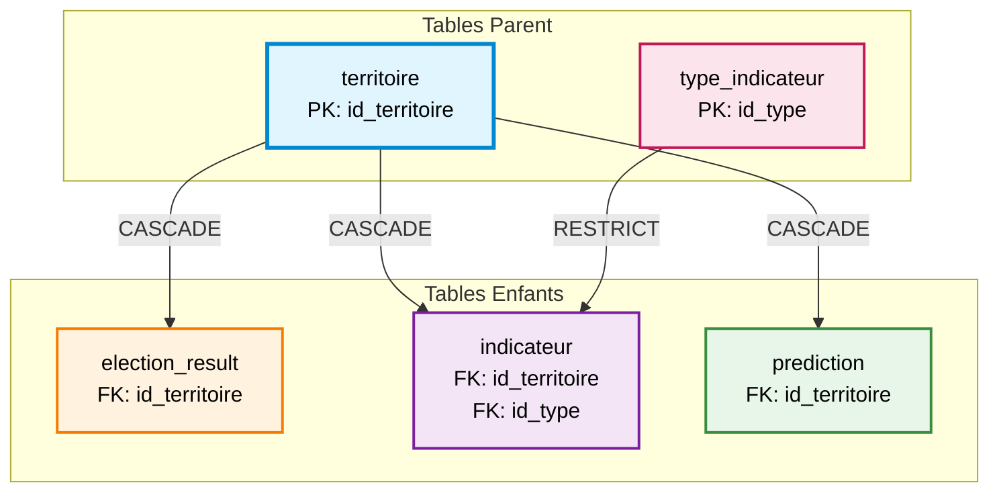

# Contraintes d'Integrite

> **OBSOLETE** : Ce document decrit le schema v2.0 (5 tables). Le schema actuel est v3.0 (17 tables).
> Voir [MLD v3.0](02-mld.md) pour les contraintes a jour.

**Version :** 2.0 (OBSOLETE - schema v3.0 deploye)
**Date :** 2026-02-10
**Auteur :** @tech
**Statut :** Archive

---

## Vue d'Ensemble

Les contraintes d'intégrité garantissent la cohérence et la validité des données à travers 3 niveaux :
1. **Contraintes de domaine** (CHECK) : Valeurs valides pour une colonne
2. **Contraintes référentielles** (FK) : Relations entre tables
3. **Contraintes d'unicité** (UNIQUE) : Absence de doublons

---

## 1. Contraintes de Domaine (CHECK)

### Table : `territoire`

#### Contrainte CK-01 : Type Territoire Valide
```sql
CHECK (type_territoire IN ('COMMUNE', 'IRIS', 'BUREAU_VOTE', 'ARRONDISSEMENT'))
```
**Objectif :** Limiter aux 4 types géographiques supportés

**Valeurs acceptées :**
- `COMMUNE` : Commune entière (ex: Bordeaux)
- `IRIS` : Découpage infra-communal INSEE
- `BUREAU_VOTE` : Unité électorale minimale
- `ARRONDISSEMENT` : Subdivision administrative (grandes villes)

**Erreur si :**
```sql
INSERT INTO territoire (..., type_territoire) VALUES (..., 'DEPARTEMENT'); -- ❌
-- ERROR: new row violates check constraint "ck_territoire_type"
```

#### Contrainte CK-02 : Population Non Négative
```sql
CHECK (population >= 0)
```
**Objectif :** Population négative impossible

**Erreur si :**
```sql
INSERT INTO territoire (..., population) VALUES (..., -100); -- ❌
-- ERROR: new row violates check constraint "ck_territoire_population"
```

---

### Table : `type_indicateur`

**Aucune contrainte CHECK** : Flexibilité maximale pour le catalogue

---

### Table : `indicateur`

#### Contrainte CK-03 : Année Raisonnable
```sql
CHECK (annee BETWEEN 2000 AND 2100)
```
**Objectif :** Éviter erreurs de saisie (ex: `1922` au lieu de `2022`)

**Valeurs acceptées :** 2000 ≤ année ≤ 2100

**Erreur si :**
```sql
INSERT INTO indicateur (..., annee) VALUES (..., 1850); -- ❌
INSERT INTO indicateur (..., annee) VALUES (..., 2150); -- ❌
```

#### Contrainte CK-04 : Fiabilité Valide
```sql
CHECK (fiabilite IN ('CONFIRME', 'ESTIME', 'PROVISOIRE', 'REVISION'))
```
**Objectif :** Qualifier le niveau de confiance des données (règle RG-06)

**Valeurs acceptées :**
| Valeur | Description |
|--------|-------------|
| `CONFIRME` | Donnée officielle validée |
| `ESTIME` | Estimation statistique |
| `PROVISOIRE` | Donnée préliminaire |
| `REVISION` | Révision d'une donnée antérieure |

**Erreur si :**
```sql
INSERT INTO indicateur (..., fiabilite) VALUES (..., 'NON_VERIFIE'); -- ❌
```

---

### Table : `election_result`

#### Contrainte CK-05 : Année Électorale Valide
```sql
CHECK (annee BETWEEN 2000 AND 2100)
```
**Objectif :** Même justification que `indicateur.annee`

#### Contrainte CK-06 : Tour Valide (1 ou 2)
```sql
CHECK (tour IN (1, 2))
```
**Objectif :** Présidentielles françaises = 2 tours maximum

**Erreur si :**
```sql
INSERT INTO election_result (..., tour) VALUES (..., 3); -- ❌
INSERT INTO election_result (..., tour) VALUES (..., 0); -- ❌
```

#### Contrainte CK-07 : Nombre de Voix Non Négatif
```sql
CHECK (nombre_voix >= 0)
```
**Objectif :** Votes négatifs impossibles

**Erreur si :**
```sql
INSERT INTO election_result (..., nombre_voix) VALUES (..., -10); -- ❌
```

#### Contrainte CK-08 : Pourcentage de Voix Valide
```sql
CHECK (pourcentage_voix BETWEEN 0 AND 100)
```
**Objectif :** Pourcentage entre 0% et 100%

**Erreur si :**
```sql
INSERT INTO election_result (..., pourcentage_voix) VALUES (..., 150.5); -- ❌
INSERT INTO election_result (..., pourcentage_voix) VALUES (..., -5.0); -- ❌
```

#### Contrainte CK-09 : Nombre d'Inscrits Non Négatif
```sql
CHECK (nombre_inscrits >= 0)
```

#### Contrainte CK-10 : Nombre de Votants Non Négatif
```sql
CHECK (nombre_votants >= 0)
```

#### Contrainte CK-11 : Nombre d'Exprimés Non Négatif
```sql
CHECK (nombre_exprimes >= 0)
```

#### Contrainte CK-12 : Taux de Participation Valide
```sql
CHECK (taux_participation BETWEEN 0 AND 100)
```
**Objectif :** Taux de participation entre 0% et 100%

**Note :** La cohérence hiérarchique (`voix ≤ exprimés ≤ votants ≤ inscrits`) est validée en applicatif (RG-03)

---

### Table : `prediction`

#### Contrainte CK-13 : Tour Valide (1 ou 2)
```sql
CHECK (tour IN (1, 2))
```
**Objectif :** Même contrainte que `election_result.tour`

#### Contrainte CK-14 : Année Prédiction Future
```sql
CHECK (annee_prediction BETWEEN 2025 AND 2050)
```
**Objectif :** Limiter horizon prédictif (25 ans maximum)

**Valeurs acceptées :** 2025 ≤ année ≤ 2050

**Erreur si :**
```sql
INSERT INTO prediction (..., annee_prediction) VALUES (..., 2022); -- ❌ (passé)
INSERT INTO prediction (..., annee_prediction) VALUES (..., 2100); -- ❌ (trop lointain)
```

#### Contrainte CK-15 : Pourcentage Prédit Valide
```sql
CHECK (pourcentage_predit BETWEEN 0 AND 100)
```

#### Contrainte CK-16 : Intervalle Confiance Inférieur Valide
```sql
CHECK (intervalle_confiance_inf BETWEEN 0 AND 100)
```

#### Contrainte CK-17 : Intervalle Confiance Supérieur Valide
```sql
CHECK (intervalle_confiance_sup BETWEEN 0 AND 100)
```

**Note :** La cohérence `IC_inf ≤ pourcentage_predit ≤ IC_sup` est validée en applicatif

---

## 2. Contraintes Référentielles (Foreign Keys)

### Vue d'Ensemble



---

### FK-01 : `indicateur.id_territoire` → `territoire.id_territoire`

```sql
FOREIGN KEY (id_territoire) REFERENCES territoire(id_territoire)
    ON DELETE CASCADE
    ON UPDATE CASCADE
```

**Règle :**
- Tout indicateur doit référencer un territoire existant
- Si territoire supprimé → indicateurs associés supprimés automatiquement (CASCADE)
- Si `id_territoire` modifié → mise à jour propagée (CASCADE)

**Justification CASCADE :**
- Suppression territoire = fusion communale → données obsolètes
- Garantit absence d'orphelins

**Erreur si :**
```sql
INSERT INTO indicateur (id_territoire, ...) VALUES ('99999', ...); -- ❌
-- ERROR: insert or update violates foreign key constraint "fk_indicateur_territoire"
-- DETAIL: Key (id_territoire)=(99999) is not present in table "territoire"
```

**Comportement CASCADE :**
```sql
DELETE FROM territoire WHERE id_territoire = '33063';
-- Supprime automatiquement tous les indicateurs avec id_territoire = '33063'
```

---

### FK-02 : `indicateur.id_type` → `type_indicateur.id_type`

```sql
FOREIGN KEY (id_type) REFERENCES type_indicateur(id_type)
    ON DELETE RESTRICT
    ON UPDATE CASCADE
```

**Règle :**
- Tout indicateur doit référencer un type existant
- Si tentative suppression type → **BLOCAGE** si indicateurs existent (RESTRICT)
- Si `id_type` modifié → mise à jour propagée (CASCADE)

**Justification RESTRICT :**
- Types = catalogue référentiel → suppression dangereuse
- Alternative : Soft delete via `actif = FALSE` (RG-07)

**Erreur si tentative suppression type utilisé :**
```sql
DELETE FROM type_indicateur WHERE id_type = 1;
-- ERROR: update or delete violates foreign key constraint "fk_indicateur_type"
-- DETAIL: Key (id_type)=(1) is still referenced from table "indicateur"
```

**Solution soft delete :**
```sql
UPDATE type_indicateur SET actif = FALSE WHERE id_type = 1; -- ✅
```

---

### FK-03 : `election_result.id_territoire` → `territoire.id_territoire`

```sql
FOREIGN KEY (id_territoire) REFERENCES territoire(id_territoire)
    ON DELETE CASCADE
    ON UPDATE CASCADE
```

**Règle :** Même logique que FK-01

**Justification CASCADE :**
- Résultats électoraux liés au territoire
- Suppression territoire → résultats obsolètes

---

### FK-04 : `prediction.id_territoire` → `territoire.id_territoire`

```sql
FOREIGN KEY (id_territoire) REFERENCES territoire(id_territoire)
    ON DELETE CASCADE
    ON UPDATE CASCADE
```

**Règle :** Même logique que FK-01 et FK-03

**Justification CASCADE :**
- Prédictions liées au territoire
- Suppression territoire → prédictions sans objet

---

## 3. Contraintes d'Unicité (UNIQUE)

### UK-01 : `type_indicateur.code_type`

```sql
UNIQUE (code_type)
```

**Objectif :** Code identifiant unique pour chaque type d'indicateur

**Exemple :**
```sql
INSERT INTO type_indicateur (code_type, ...) VALUES ('SECURITE_CAMBRIOLAGES', ...);
INSERT INTO type_indicateur (code_type, ...) VALUES ('SECURITE_CAMBRIOLAGES', ...); -- ❌
-- ERROR: duplicate key value violates unique constraint "uk_type_indicateur_code"
```

**Index associé :** `uk_type_indicateur_code` (B-Tree, créé automatiquement)

---

### UK-02 : `indicateur` (Composite)

```sql
UNIQUE (id_territoire, id_type, annee, periode)
```

**Objectif :** 1 seule valeur par territoire/type/année/période (évite doublons)

**Règle :** Pour un territoire donné, un type d'indicateur ne peut avoir qu'une seule valeur par période

**Exemple :**
```sql
-- ✅ Valeurs différentes pour périodes différentes
INSERT INTO indicateur (...) VALUES ('33063', 1, 2022, 'T1', ...);
INSERT INTO indicateur (...) VALUES ('33063', 1, 2022, 'T2', ...);

-- ❌ Doublon pour même période
INSERT INTO indicateur (...) VALUES ('33063', 1, 2022, 'T1', ...); -- ERREUR
-- ERROR: duplicate key violates unique constraint "uk_indicateur_unique"
```

**Cas particulier NULL :**
- `periode = NULL` représente donnée annuelle
- PostgreSQL considère NULL ≠ NULL → plusieurs lignes avec `periode = NULL` acceptées si autres colonnes différentes

**Index associé :** `uk_indicateur_unique` (B-Tree composite)

---

### UK-03 : `election_result` (Composite)

```sql
UNIQUE (id_territoire, annee, tour, candidat)
```

**Objectif :** 1 seul résultat par candidat/bureau/tour (règle RG-02)

**Règle :** Un candidat ne peut avoir qu'un seul score par territoire, année et tour

**Exemple :**
```sql
-- ✅ Différents candidats
INSERT INTO election_result (...) VALUES ('BV_33063_001', 2022, 1, 'Emmanuel MACRON', ...);
INSERT INTO election_result (...) VALUES ('BV_33063_001', 2022, 1, 'Marine LE PEN', ...);

-- ✅ Même candidat, tour différent
INSERT INTO election_result (...) VALUES ('BV_33063_001', 2022, 2, 'Emmanuel MACRON', ...);

-- ❌ Doublon exact
INSERT INTO election_result (...) VALUES ('BV_33063_001', 2022, 1, 'Emmanuel MACRON', ...); -- ERREUR
-- ERROR: duplicate key violates unique constraint "uk_election_result_unique"
```

**Index associé :** `uk_election_result_unique` (B-Tree composite)

---

### UK-04 : `prediction` (Composite)

```sql
UNIQUE (id_territoire, candidat, tour, annee_prediction, version_modele)
```

**Objectif :** Versioning des prédictions (plusieurs modèles/versions pour même candidat)

**Règle :** Une prédiction unique par combinaison territoire/candidat/tour/année/version

**Exemple :**
```sql
-- ✅ Même candidat, versions différentes
INSERT INTO prediction (...) VALUES ('IRIS_330630101', 'MACRON', 1, 2027, 'v1.0.0', ...);
INSERT INTO prediction (...) VALUES ('IRIS_330630101', 'MACRON', 1, 2027, 'v2.0.0', ...);

-- ✅ Même candidat, tours différents
INSERT INTO prediction (...) VALUES ('IRIS_330630101', 'MACRON', 2, 2027, 'v1.0.0', ...);

-- ❌ Doublon exact
INSERT INTO prediction (...) VALUES ('IRIS_330630101', 'MACRON', 1, 2027, 'v1.0.0', ...); -- ERREUR
-- ERROR: duplicate key violates unique constraint "uk_prediction_unique"
```

**Index associé :** `uk_prediction_unique` (B-Tree composite)

---

## 4. Contraintes Implicites (Clés Primaires)

### PK : Clés Primaires

| Table | Colonne PK | Type | Auto-incrémenté |
|-------|------------|------|-----------------|
| `territoire` | `id_territoire` | VARCHAR(20) | ✗ (manuel) |
| `type_indicateur` | `id_type` | SERIAL | ✅ |
| `indicateur` | `id_indicateur` | BIGSERIAL | ✅ |
| `election_result` | `id_result` | BIGSERIAL | ✅ |
| `prediction` | `id_prediction` | BIGSERIAL | ✅ |

**Propriétés PK :**
- `NOT NULL` : Obligatoire
- `UNIQUE` : Unicité garantie
- **Index B-Tree** créé automatiquement

**Erreur si NULL :**
```sql
INSERT INTO territoire (id_territoire, ...) VALUES (NULL, ...); -- ❌
-- ERROR: null value in column "id_territoire" violates not-null constraint
```

**Erreur si doublon :**
```sql
INSERT INTO territoire (id_territoire, ...) VALUES ('33063', ...);
INSERT INTO territoire (id_territoire, ...) VALUES ('33063', ...); -- ❌
-- ERROR: duplicate key value violates unique constraint "territoire_pkey"
```

---

## 5. Contraintes par Défaut (DEFAULT)

### Valeurs par Défaut

| Table | Colonne | Valeur par défaut |
|-------|---------|-------------------|
| `territoire` | `created_at` | `NOW()` |
| `territoire` | `updated_at` | `NOW()` |
| `type_indicateur` | `actif` | `TRUE` |
| `type_indicateur` | `created_at` | `NOW()` |
| `indicateur` | `fiabilite` | `'CONFIRME'` |
| `indicateur` | `created_at` | `NOW()` |
| `election_result` | `created_at` | `NOW()` |
| `prediction` | `date_generation` | `NOW()` |

**Avantages :**
- Automatisation horodatage
- Valeurs par défaut cohérentes
- Simplification INSERT

**Exemple :**
```sql
-- Sans spécifier created_at
INSERT INTO territoire (id_territoire, code_insee, type_territoire, nom_territoire)
VALUES ('33063', '33063', 'COMMUNE', 'Bordeaux');
-- created_at = timestamp actuel (automatique)

-- Sans spécifier fiabilite
INSERT INTO indicateur (id_territoire, id_type, annee, valeur_numerique)
VALUES ('33063', 1, 2022, 504.0);
-- fiabilite = 'CONFIRME' (par défaut)
```

---

## 6. Récapitulatif des Contraintes

### Par Type

| Type | Nombre | Tables Concernées |
|------|--------|-------------------|
| **CHECK** | 17 | `territoire`, `indicateur`, `election_result`, `prediction` |
| **FOREIGN KEY** | 4 | `indicateur`, `election_result`, `prediction` |
| **UNIQUE** | 4 | `type_indicateur`, `indicateur`, `election_result`, `prediction` |
| **PRIMARY KEY** | 5 | Toutes tables |
| **DEFAULT** | 9 | Toutes tables |
| **TOTAL** | **39** | - |

### Matrice de Couverture

| Table | CHECK | FK | UNIQUE | PK | DEFAULT |
|-------|-------|----|----|-----|----|
| `territoire` | 2 | 0 | 0 | 1 | 2 |
| `type_indicateur` | 0 | 0 | 1 | 1 | 2 |
| `indicateur` | 2 | 2 | 1 | 1 | 2 |
| `election_result` | 8 | 1 | 1 | 1 | 1 |
| `prediction` | 5 | 1 | 1 | 1 | 1 |

---

## 7. Gestion des Erreurs

### Messages d'Erreur Courants

#### Violation Contrainte CHECK
```
ERROR: new row for relation "election_result" violates check constraint "ck_election_result_tour"
DETAIL: Failing row contains (..., tour=3, ...)
```

**Solution :** Corriger la valeur (`tour` doit être 1 ou 2)

#### Violation Contrainte FK
```
ERROR: insert or update on table "indicateur" violates foreign key constraint "fk_indicateur_territoire"
DETAIL: Key (id_territoire)=(99999) is not present in table "territoire"
```

**Solution :** Insérer d'abord le territoire ou corriger `id_territoire`

#### Violation Contrainte UNIQUE
```
ERROR: duplicate key value violates unique constraint "uk_election_result_unique"
DETAIL: Key (id_territoire, annee, tour, candidat)=(33063, 2022, 1, MACRON) already exists
```

**Solution :** Utiliser UPDATE au lieu de INSERT, ou corriger les valeurs

---

**Prochaine étape :** Consulter [Index et Optimisation](06-index-optimisation.md) pour stratégies de performance.
