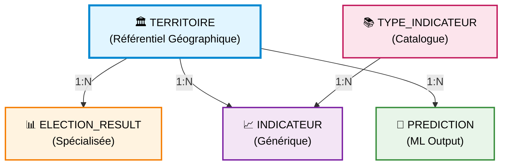

# Documentation Base de Données - Electio-Analytics

**Version :** 2.0
**Date :** 2026-02-10
**Auteur :** @tech
**Statut :** ✅ Production-Ready
**SGBD :** PostgreSQL 15+ avec PostGIS

---

## 📚 Structure de la Documentation

Cette documentation est organisée en modules thématiques pour faciliter la navigation et la maintenance.

### 1. [Modèle Conceptuel de Données (MCD)](01-mcd.md)
- Vue d'ensemble architecture
- Diagramme Entité-Association (Crow's Foot)
- Description des entités et relations
- Cardinalités

### 2. [Modèle Logique de Données (MLD)](02-mld.md)
- Schéma relationnel normalisé (3FN)
- Clés primaires et étrangères
- Tables détaillées en notation formelle

### 3. [Dictionnaire de Données](03-dictionnaire-donnees.md)
- Description exhaustive de chaque colonne
- Types de données et contraintes
- Exemples de valeurs
- 5 tables documentées

### 4. [Règles de Gestion](04-regles-gestion.md)
- RG-01 à RG-07 : Règles métier
- Implémentation technique
- Justifications business

### 5. [Contraintes d'Intégrité](05-contraintes-integrite.md)
- Contraintes de domaine (CHECK)
- Contraintes référentielles (FK)
- Contraintes d'unicité (UNIQUE)

### 6. [Index et Optimisation](06-index-optimisation.md)
- 18 indexes créés
- Stratégies d'optimisation
- Index composites, GIN, GiST

### 7. [Volumétrie et Performance](07-volumetrie-performance.md)
- Estimations volumétriques
- Benchmarks PostgreSQL
- Recommandations production

### 8. [Évolutions Futures](08-evolutions-futures.md)
- Roadmap schéma v3.0
- Fonctionnalités planifiées
- Priorités et complexité

---

## 🎯 Accès Rapide

| Besoin | Document |
|--------|----------|
| **Comprendre l'architecture globale** | [MCD](01-mcd.md) |
| **Écrire une requête SQL** | [MLD](02-mld.md) |
| **Connaître le type d'une colonne** | [Dictionnaire de données](03-dictionnaire-donnees.md) |
| **Valider une règle métier** | [Règles de gestion](04-regles-gestion.md) |
| **Optimiser une requête lente** | [Index et optimisation](06-index-optimisation.md) |
| **Planifier la scalabilité** | [Volumétrie](07-volumetrie-performance.md) |

---

## 📐 Principes de Design

| Principe | Description |
|----------|-------------|
| **Normalisation** | 3FN (Troisième Forme Normale) |
| **Extensibilité** | Pattern EAV hybride pour nouveaux indicateurs |
| **Performance** | Indexation optimisée pour requêtes ML |
| **Flexibilité** | Colonnes JSONB pour métadonnées variables |
| **Intégrité** | Contraintes référentielles strictes (CASCADE) |

---

## 🏗️ Architecture v2.0 - Aperçu



**5 tables principales :**
- `territoire` : Référentiel géographique (IRIS, Bureaux, Communes)
- `type_indicateur` : Catalogue des types d'indicateurs
- `indicateur` : Table générique (Sécurité, Emploi, Démographie)
- `election_result` : Résultats électoraux 2017 & 2022
- `prediction` : Prédictions ML 2027

---

## 🚀 Démarrage Rapide

### Installation PostgreSQL
```bash
# Voir src/database/README.md pour instructions complètes
sudo apt install postgresql postgis
createdb electio_analytics
```

### Exécuter la Migration
```bash
psql -U admin -d electio_analytics -f src/database/migrations/001_initial_schema.sql
```

### Valider l'Installation
```sql
SELECT * FROM validate_database_integrity();
```

---

## 📊 Statistiques Schéma

| Métrique | Valeur |
|----------|--------|
| **Tables** | 5 |
| **Contraintes FK** | 4 |
| **Indexes** | 18 |
| **Vues** | 2 |
| **Types d'indicateurs** | 20 (pré-chargés) |
| **Volumétrie estimée** | ~24 300 lignes (~4 MB) |

---

## 🔗 Liens Utiles

- [Script de migration](../../../src/database/migrations/001_initial_schema.sql)
- [Configuration Python](../../../src/database/config.py)
- [Module Database README](../../../src/database/README.md)
- [Archive versions précédentes](versions/)

---

## 📝 Historique des Versions

| Version | Date | Statut | Description | Documentation |
|---------|------|--------|-------------|---------------|
| **2.0** | 2026-02-10 | ✅ **ACTUELLE** | Architecture scalable (EAV hybride) | [MCD](01-mcd.md) · [MLD](02-mld.md) |
| **1.0** | 2026-02-09 | 🗄️ Archivée | Schéma initial (5 tables séparées) | [Archive v1.0](versions/v1.0/) |

### 📂 Gestion des Versions

- **[CHANGELOG](versions/CHANGELOG.md)** - Historique détaillé des changements
- **[VERSIONS](versions/VERSIONS.md)** - Tableau comparatif v1.0 vs v2.0
- **[Archives](versions/)** - Versions précédentes du schéma

### 🔄 Politique de Versioning

Ce projet utilise le **versioning sémantique** :
- **MAJOR** (v2.0) : Breaking changes (incompatibilité avec versions précédentes)
- **MINOR** (v2.1) : Nouvelles fonctionnalités rétrocompatibles
- **PATCH** (v2.0.1) : Corrections de bugs et optimisations

---

**Prochaine étape :** Consulter le [MCD](01-mcd.md) pour comprendre l'architecture conceptuelle.
