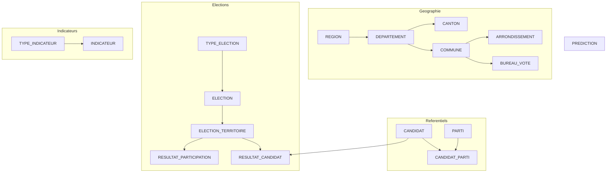

# Documentation Base de Donnees - Electio-Analytics

**Version :** 3.0
**Date :** 2026-02-12
**Auteur :** @tech
**Statut :** Production-Ready
**SGBD :** PostgreSQL 15+

---

## Structure de la Documentation

### Documents v3.0 (a jour)

#### 1. [Modele Conceptuel de Donnees (MCD)](01-mcd.md)
- Vue d'ensemble architecture v3.0
- Diagramme Entite-Association
- 17 entites, hierarchie geographique, systeme polymorphe

#### 2. [Modele Logique de Donnees (MLD)](02-mld.md)
- Schema relationnel normalise (3FN)
- 17 tables avec definitions SQL completes
- Cles primaires, etrangeres, contraintes CHECK
- Diagramme Mermaid

#### 3. [Dictionnaire de Donnees](03-dictionnaire-donnees.md)
- Description exhaustive de chaque colonne (17 tables)
- Types de donnees et contraintes
- Exemples de valeurs
- Volumetrie reelle (~17 262 lignes)

### Documents v2.0 (archives - obsoletes)

> Les documents suivants decrivent le schema v2.0 (5 tables) qui n'est plus en production.
> Ils sont conserves pour reference historique uniquement.

#### 4. [Regles de Gestion](04-regles-gestion.md) - OBSOLETE
#### 5. [Contraintes d'Integrite](05-contraintes-integrite.md) - OBSOLETE
#### 6. [Index et Optimisation](06-index-optimisation.md) - OBSOLETE
#### 7. [Volumetrie et Performance](07-volumetrie-performance.md) - OBSOLETE
#### 8. [Evolutions Futures](08-evolutions-futures.md) - OBSOLETE (v3.0 deploye)

---

## Acces Rapide

| Besoin | Document |
|--------|----------|
| **Comprendre l'architecture** | [MCD](01-mcd.md) |
| **Ecrire une requete SQL** | [MLD](02-mld.md) |
| **Connaitre le type d'une colonne** | [Dictionnaire de donnees](03-dictionnaire-donnees.md) |
| **Voir l'architecture ETL** | [ARCHITECTURE.md](../ARCHITECTURE.md) |

---

## Architecture v3.0

**17 tables** reparties en 6 domaines :
- **Geographique** (6) : region, departement, commune, canton, arrondissement, bureau_vote
- **References electorales** (2) : type_election, election
- **References politiques** (3) : candidat, parti, candidat_parti
- **Resultats** (3) : election_territoire, resultat_participation, resultat_candidat
- **Indicateurs** (2) : type_indicateur, indicateur
- **ML** (1) : prediction

---

## Statistiques Schema v3.0

| Metrique | Valeur |
|----------|--------|
| **Tables** | 17 |
| **Contraintes FK** | 15 |
| **Indexes** | 30+ |
| **Donnees chargees** | ~17 262 lignes |

---

## Historique des Versions

| Version | Date | Statut | Description |
|---------|------|--------|-------------|
| **3.0** | 2026-02-12 | **ACTUELLE** | Hierarchie geographique, systeme polymorphe, 17 tables |
| **2.0** | 2026-02-10 | Archive | Architecture EAV hybride, 5 tables |
| **1.0** | 2026-02-09 | Archive | Schema initial, 5 tables separees |

- **[CHANGELOG](versions/CHANGELOG.md)** - Historique detaille
- **[VERSIONS](versions/VERSIONS.md)** - Tableau comparatif
- **[Archives](versions/)** - Versions precedentes
