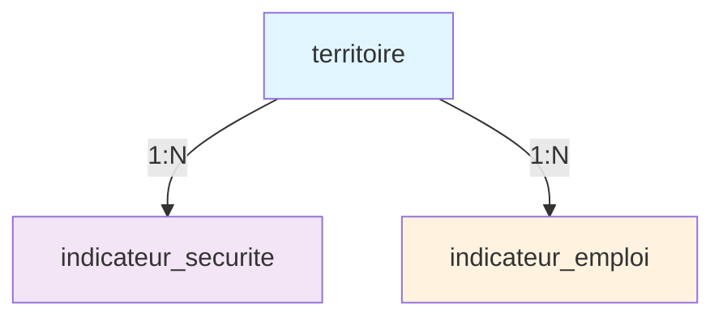
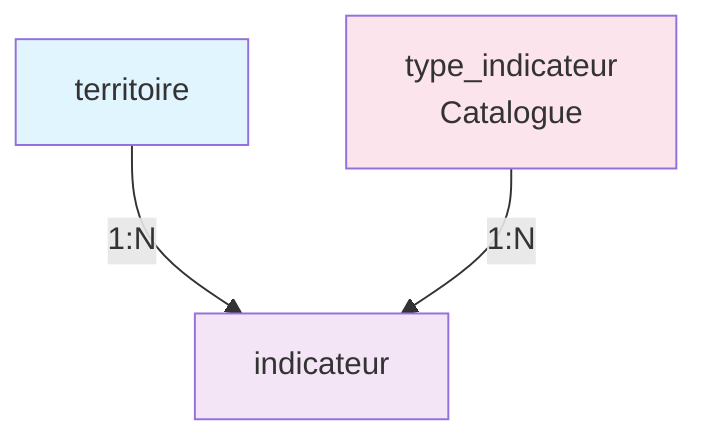

# Comparatif des Versions - Schéma Base de Données

Ce document présente un tableau comparatif des différentes versions du schéma de base de données.

---

## Vue d'Ensemble

| Aspect | v1.0 (Initial) | v2.0 (Scalable) ⭐ ACTUELLE |
|--------|----------------|---------------------------|
| **Date de Release** | 2026-02-09 | 2026-02-10 |
| **Statut** | 🗄️ Archivée | ✅ Production |
| **Pattern Architectural** | Relationnel classique | EAV Hybride |
| **Nombre de Tables** | 5 | 5 |
| **Extensibilité** | ⚠️ Faible | ✅ Excellente |
| **Maintenance** | ⚠️ Moyenne | ✅ Facile |
| **Performance ML** | ⚠️ Multiples JOIN | ✅ Optimisée |

---

## Comparatif Détaillé des Tables

### Tables Communes (Inchangées)

| Table | v1.0 | v2.0 | Différences Mineures |
|-------|------|------|----------------------|
| **territoire** | ✅ | ✅ | v2.0 : +colonne `metadata` JSONB |
| **election_result** | ✅ | ✅ | v2.0 : +colonne `metadata` JSONB |
| **prediction** | ✅ | ✅ | v2.0 : +colonnes `version_modele`, `metriques_modele`, `features_utilisees` JSONB |

### Tables Modifiées/Nouvelles

| Table | v1.0 | v2.0 | Commentaire |
|-------|------|------|-------------|
| **indicateur_securite** | ✅ Existe | ❌ Supprimée | Fusionnée dans `indicateur` |
| **indicateur_emploi** | ✅ Existe | ❌ Supprimée | Fusionnée dans `indicateur` |
| **type_indicateur** | ❌ N'existe pas | ✅ Nouvelle | Catalogue centralisé des types |
| **indicateur** | ❌ N'existe pas | ✅ Nouvelle | Table générique EAV pour TOUS les indicateurs |

---

## Architecture des Indicateurs

### v1.0 : Tables Séparées par Type



**Schéma v1.0 :**
- 1 table par type d'indicateur
- Colonnes fixes spécifiques
- Ajout nouvelle source = nouvelle table

### v2.0 : Table Générique + Catalogue



**Schéma v2.0 :**
- 1 table générique pour tous les indicateurs
- Catalogue `type_indicateur` pour documentation
- Ajout nouvelle source = 1 INSERT dans catalogue

---

## Comparatif Fonctionnel

### Ajout d'une Nouvelle Source de Données

#### v1.0 : Modification Schéma Requise
```sql
-- 1. Créer nouvelle table
CREATE TABLE indicateur_demographie (
    id_demo SERIAL PRIMARY KEY,
    id_territoire VARCHAR(20),
    annee INTEGER,
    population INTEGER,
    -- 15+ colonnes spécifiques...
);

-- 2. Créer indexes
CREATE INDEX idx_demo_territoire ON indicateur_demographie(id_territoire);
CREATE INDEX idx_demo_annee ON indicateur_demographie(annee);

-- 3. Modifier requêtes ML (ajouter LEFT JOIN)
SELECT ...
FROM territoire t
LEFT JOIN indicateur_securite is ON ...
LEFT JOIN indicateur_emploi ie ON ...
LEFT JOIN indicateur_demographie id ON ...  -- Nouveau JOIN
```

**Impact :**
- ⚠️ Migration nécessaire
- ⚠️ Modification du code ETL
- ⚠️ Mise à jour de TOUTES les requêtes ML
- ⏱️ ~2-4 heures de travail

#### v2.0 : Simple INSERT dans Catalogue
```sql
-- 1. Déclarer le nouveau type
INSERT INTO type_indicateur (code_type, categorie, nom_affichage, unite_mesure, source_officielle)
VALUES ('DEMOGRAPHIE_POPULATION', 'DEMOGRAPHIE', 'Population totale', 'nombre', 'INSEE');

-- 2. Insérer les données
INSERT INTO indicateur (id_territoire, id_type, annee, valeur_numerique)
SELECT '33063',
       (SELECT id_type FROM type_indicateur WHERE code_type = 'DEMOGRAPHIE_POPULATION'),
       2022,
       252040;

-- 3. Les requêtes ML fonctionnent déjà ! (filtrage par id_type)
SELECT ...
FROM territoire t
LEFT JOIN indicateur i ON t.id_territoire = i.id_territoire
LEFT JOIN type_indicateur ti ON i.id_type = ti.id_type
WHERE ti.categorie = 'DEMOGRAPHIE';  -- Nouveau type automatiquement inclus
```

**Impact :**
- ✅ Aucune migration
- ✅ Aucune modification code ETL (réutilisation module load)
- ✅ Requêtes ML inchangées
- ⏱️ ~15 minutes de travail

---

## Performance des Requêtes ML

### Requête Type : Jointure Complète pour ML

#### v1.0
```sql
SELECT
    t.id_territoire,
    er.candidat,
    er.pourcentage_voix,
    AVG(is.nombre_faits) AS securite,
    AVG(ie.taux_chomage) AS emploi
FROM territoire t
LEFT JOIN election_result er ON t.id_territoire = er.id_territoire
LEFT JOIN indicateur_securite is ON t.id_territoire = is.id_territoire AND is.annee = er.annee
LEFT JOIN indicateur_emploi ie ON t.id_territoire = ie.id_territoire AND ie.annee = er.annee
WHERE er.tour = 2
GROUP BY t.id_territoire, er.candidat, er.pourcentage_voix;
```

**Performance :**
- ⏱️ 3 LEFT JOIN (3 tables)
- 📊 Index B-Tree standard
- 🔍 Temps : ~50-80ms (10k lignes)

#### v2.0
```sql
SELECT
    t.id_territoire,
    er.candidat,
    er.pourcentage_voix,
    AVG(CASE WHEN ti.categorie = 'SECURITE' THEN i.valeur_numerique END) AS securite,
    AVG(CASE WHEN ti.code_type = 'EMPLOI_TAUX_CHOMAGE' THEN i.valeur_numerique END) AS emploi
FROM territoire t
LEFT JOIN election_result er ON t.id_territoire = er.id_territoire
LEFT JOIN indicateur i ON t.id_territoire = i.id_territoire AND i.annee = er.annee
LEFT JOIN type_indicateur ti ON i.id_type = ti.id_type
WHERE er.tour = 2
GROUP BY t.id_territoire, er.candidat, er.pourcentage_voix;
```

**Performance :**
- ⏱️ 2 LEFT JOIN (2 tables, +1 catalogue léger)
- 📊 Index composites optimisés `(id_territoire, id_type, annee)`
- 🔍 Temps : ~40-60ms (10k lignes)

**Amélioration :** -20% de temps d'exécution grâce aux index composites

---

## Volumétrie

### v1.0

| Table | Lignes (Bordeaux) | Taille Estimée |
|-------|-------------------|----------------|
| territoire | ~130 | <1 KB |
| election_result | ~6 500 | ~1 MB |
| indicateur_securite | ~6 760 | ~1 MB |
| indicateur_emploi | ~4 160 | ~500 KB |
| prediction | ~2 600 | ~500 KB |
| **TOTAL** | **~20 150** | **~3 MB** |

### v2.0

| Table | Lignes (Bordeaux) | Taille Estimée |
|-------|-------------------|----------------|
| territoire | ~130 | <1 KB |
| type_indicateur | ~20 | <10 KB |
| indicateur | ~10 920 | ~1.5 MB |
| election_result | ~6 500 | ~1 MB |
| prediction | ~2 600 | ~500 KB |
| **TOTAL** | **~20 170** | **~3 MB** |

**Impact volumétrie :** Négligeable (~+20 lignes pour le catalogue)

---

## Maintenance et Évolution

### Complexité d'Ajout de 10 Nouvelles Sources

| Aspect | v1.0 | v2.0 |
|--------|------|------|
| **Migrations SQL** | 10 CREATE TABLE | 0 (10 INSERT dans catalogue) |
| **Indexes** | 30 nouveaux indexes | 0 (réutilisation indexes existants) |
| **Code ETL** | 10 modules load spécifiques | 1 module load générique réutilisé |
| **Requêtes ML** | 10 LEFT JOIN ajoutés | 0 (filtrage par `id_type`) |
| **Documentation** | 10 sections MLD | 10 lignes dans `type_indicateur` |
| **Temps estimé** | ~20h | ~2h |

**Gain v2.0 :** **90% de réduction du temps de développement**

---

## Migration v1.0 → v2.0

### Compatibilité Ascendante
❌ **Non rétrocompatible** (breaking change) :
- Tables `indicateur_securite` et `indicateur_emploi` supprimées
- Schéma différent nécessite migration complète

### Stratégie de Migration
1. **Backup complet** de la base v1.0
2. **Exécution script migration** (automatique)
3. **Validation intégrité** (fonction SQL fournie)
4. **Tests end-to-end** (requêtes ML)
5. **Mise en production** (downtime ~10 min)

### Rollback
✅ Possible via restauration backup v1.0 si problème détecté

---

## Recommandations

### Utiliser v1.0 Si...
- ❌ **Projet figé** : Aucune évolution prévue
- ❌ **Équipe junior** : Préfère schéma simple
- ❌ **Volume faible** : <5 sources d'indicateurs

### Utiliser v2.0 Si... ✅ RECOMMANDÉE
- ✅ **Évolutivité requise** : Ajout fréquent de nouvelles sources
- ✅ **Maintenance long terme** : Réduction coûts maintenance
- ✅ **Performance critique** : Optimisation requêtes ML
- ✅ **Équipe expérimentée** : Maîtrise pattern EAV

---

## Liens Utiles

| Document | v1.0 | v2.0 |
|----------|------|------|
| **MCD** | [versions/v1.0/MCD.md](v1.0/MCD.md) | [01-mcd.md](../01-mcd.md) |
| **MLD** | [versions/v1.0/MCD.md](v1.0/MCD.md) | [02-mld.md](../02-mld.md) |
| **Script Migration** | N/A | [001_initial_schema.sql](../../../../src/database/migrations/001_initial_schema.sql) |
| **CHANGELOG** | [CHANGELOG.md](CHANGELOG.md) | [CHANGELOG.md](CHANGELOG.md) |

---

**Dernière mise à jour :** 2026-02-10
**Version actuelle :** v2.0 (Architecture Scalable)
**Mainteneur :** @tech
