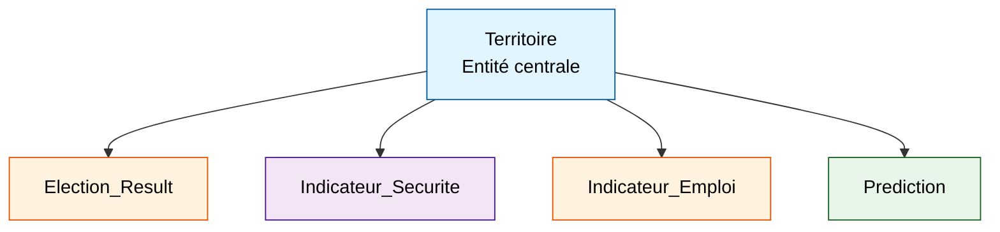
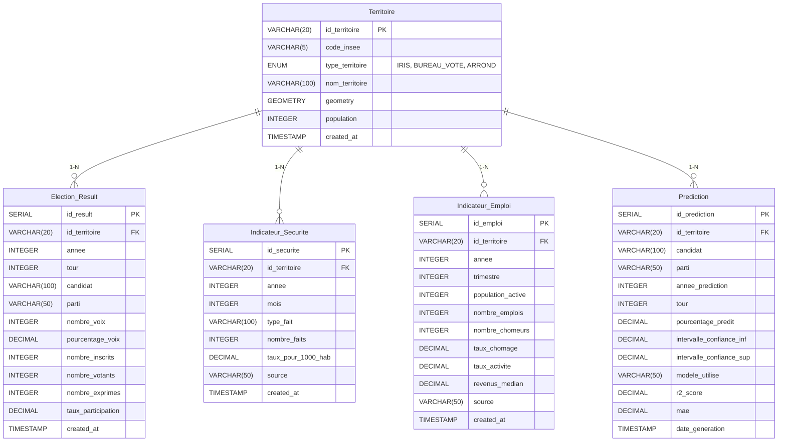

# Modèle Conceptuel de Données (MCD)
## Electio-Analytics - Bordeaux Arrondissement Centre

**Version :** 1.0
**Date :** 2026-02-09
**Périmètre :** Bordeaux Arrondissement Centre - Présidentielles 2017 & 2022 (1er et 2nd tours) → Prédiction 2027

---

## Vue d'ensemble

Le MCD structure les données en **5 entités principales** liées par des relations **1-N** autour de l'entité centrale `Territoire`.



---

## Entité 1 : `Territoire`

**Description :** Référentiel géographique unique pour le périmètre (IRIS, Bureaux de vote, Arrondissement).

| Champ | Type | Contrainte | Description |
|-------|------|------------|-------------|
| **id_territoire** | VARCHAR(20) | PK | Identifiant unique (ex: `IRIS_330630101`, `BV_33063_001`) |
| code_insee | VARCHAR(5) | NOT NULL | Code INSEE commune (33063 = Bordeaux) |
| type_territoire | ENUM | NOT NULL | Type : `IRIS`, `BUREAU_VOTE`, `ARRONDISSEMENT` |
| nom_territoire | VARCHAR(100) | NOT NULL | Nom lisible (ex: "Bordeaux Centre IRIS 0101") |
| geometry | GEOMETRY | NULL | Polygone géographique (optionnel, pour cartographie) |
| population | INTEGER | NULL | Population totale (recensement INSEE) |
| created_at | TIMESTAMP | DEFAULT NOW() | Date de création |

**Clé primaire :** `id_territoire`
**Index :** `code_insee`, `type_territoire`

---

## Entité 2 : `Election_Result`

**Description :** Résultats électoraux présidentielles 2017 & 2022 (1er et 2nd tours) par territoire.

| Champ | Type | Contrainte | Description |
|-------|------|------------|-------------|
| **id_result** | SERIAL | PK | Identifiant auto-incrémenté |
| id_territoire | VARCHAR(20) | FK → Territoire | Référence au territoire |
| annee | INTEGER | NOT NULL | Année élection (2017, 2022) |
| tour | INTEGER | NOT NULL | Tour (1 ou 2) |
| candidat | VARCHAR(100) | NOT NULL | Nom candidat (ex: "Emmanuel MACRON") |
| parti | VARCHAR(50) | NULL | Parti politique (ex: "LREM", "RN", "LFI") |
| nombre_voix | INTEGER | NOT NULL | Nombre de voix obtenues |
| pourcentage_voix | DECIMAL(5,2) | NOT NULL | % voix exprimées (ex: 28.45) |
| nombre_inscrits | INTEGER | NOT NULL | Nombre d'inscrits |
| nombre_votants | INTEGER | NOT NULL | Nombre de votants |
| nombre_exprimes | INTEGER | NOT NULL | Nombre de voix exprimées |
| taux_participation | DECIMAL(5,2) | NOT NULL | % participation (ex: 75.30) |
| created_at | TIMESTAMP | DEFAULT NOW() | Date d'insertion |

**Clé primaire :** `id_result`
**Clé étrangère :** `id_territoire` → `Territoire(id_territoire)` ON DELETE CASCADE
**Index composé :** `(id_territoire, annee, tour, candidat)`
**Contrainte unicité :** UNIQUE(id_territoire, annee, tour, candidat)

---

## Entité 3 : `Indicateur_Securite`

**Description :** Indicateurs de criminalité/délinquance SSMSI par territoire et année.

| Champ | Type | Contrainte | Description |
|-------|------|------------|-------------|
| **id_securite** | SERIAL | PK | Identifiant auto-incrémenté |
| id_territoire | VARCHAR(20) | FK → Territoire | Référence au territoire |
| annee | INTEGER | NOT NULL | Année (2017-2024) |
| mois | INTEGER | NULL | Mois (1-12, NULL si annuel) |
| type_fait | VARCHAR(100) | NOT NULL | Type de délit (ex: "Cambriolages", "Vols violents") |
| nombre_faits | INTEGER | NOT NULL | Nombre de faits constatés |
| taux_pour_1000_hab | DECIMAL(8,2) | NULL | Taux pour 1000 habitants |
| source | VARCHAR(50) | DEFAULT 'SSMSI' | Source des données |
| created_at | TIMESTAMP | DEFAULT NOW() | Date d'insertion |

**Clé primaire :** `id_securite`
**Clé étrangère :** `id_territoire` → `Territoire(id_territoire)` ON DELETE CASCADE
**Index composé :** `(id_territoire, annee, type_fait)`
**Contrainte unicité :** UNIQUE(id_territoire, annee, mois, type_fait)

**Types de faits SSMSI (13 indicateurs) :**
- Cambriolages de logement
- Vols de véhicules
- Vols dans véhicules
- Vols violents sans arme
- Vols avec armes
- Coups et blessures volontaires
- Violences sexuelles
- Trafic de stupéfiants
- Destructions et dégradations
- Escroqueries
- Homicides
- Usage-détention de stupéfiants
- Violences intrafamiliales

---

## Entité 4 : `Indicateur_Emploi`

**Description :** Indicateurs emploi/chômage INSEE par territoire et année.

| Champ | Type | Contrainte | Description |
|-------|------|------------|-------------|
| **id_emploi** | SERIAL | PK | Identifiant auto-incrémenté |
| id_territoire | VARCHAR(20) | FK → Territoire | Référence au territoire |
| annee | INTEGER | NOT NULL | Année (2017-2024) |
| trimestre | INTEGER | NULL | Trimestre (1-4, NULL si annuel) |
| population_active | INTEGER | NULL | Population active totale |
| nombre_emplois | INTEGER | NULL | Nombre d'emplois |
| nombre_chomeurs | INTEGER | NULL | Nombre de demandeurs d'emploi |
| taux_chomage | DECIMAL(5,2) | NOT NULL | % chômage (ex: 8.50) |
| taux_activite | DECIMAL(5,2) | NULL | % population active |
| revenus_median | DECIMAL(10,2) | NULL | Revenu médian annuel (€) |
| source | VARCHAR(50) | DEFAULT 'INSEE' | Source (INSEE, DARES) |
| created_at | TIMESTAMP | DEFAULT NOW() | Date d'insertion |

**Clé primaire :** `id_emploi`
**Clé étrangère :** `id_territoire` → `Territoire(id_territoire)` ON DELETE CASCADE
**Index composé :** `(id_territoire, annee, trimestre)`
**Contrainte unicité :** UNIQUE(id_territoire, annee, trimestre)

---

## Entité 5 : `Prediction`

**Description :** Prédictions électorales 2027 générées par le modèle ML.

| Champ | Type | Contrainte | Description |
|-------|------|------------|-------------|
| **id_prediction** | SERIAL | PK | Identifiant auto-incrémenté |
| id_territoire | VARCHAR(20) | FK → Territoire | Référence au territoire |
| candidat | VARCHAR(100) | NOT NULL | Nom candidat prédit |
| parti | VARCHAR(50) | NULL | Parti politique |
| annee_prediction | INTEGER | DEFAULT 2027 | Année prédite |
| tour | INTEGER | NOT NULL | Tour prédit (1 ou 2) |
| pourcentage_predit | DECIMAL(5,2) | NOT NULL | % voix prédit (ex: 32.10) |
| intervalle_confiance_inf | DECIMAL(5,2) | NULL | Borne inférieure IC 95% |
| intervalle_confiance_sup | DECIMAL(5,2) | NULL | Borne supérieure IC 95% |
| modele_utilise | VARCHAR(50) | NOT NULL | Nom du modèle (ex: "RandomForest_v1.2") |
| r2_score | DECIMAL(5,4) | NULL | Score R² du modèle |
| mae | DECIMAL(5,2) | NULL | Mean Absolute Error |
| date_generation | TIMESTAMP | DEFAULT NOW() | Date de génération |

**Clé primaire :** `id_prediction`
**Clé étrangère :** `id_territoire` → `Territoire(id_territoire)` ON DELETE CASCADE
**Index composé :** `(id_territoire, candidat, tour)`

---

## Relations & Cardinalités

### Relation 1 : Territoire ↔ Election_Result
- **Type :** 1-N (Un territoire a plusieurs résultats électoraux)
- **Clé étrangère :** `Election_Result.id_territoire` → `Territoire.id_territoire`
- **Intégrité :** ON DELETE CASCADE (si territoire supprimé → résultats supprimés)

### Relation 2 : Territoire ↔ Indicateur_Securite
- **Type :** 1-N (Un territoire a plusieurs indicateurs de sécurité)
- **Clé étrangère :** `Indicateur_Securite.id_territoire` → `Territoire.id_territoire`
- **Intégrité :** ON DELETE CASCADE

### Relation 3 : Territoire ↔ Indicateur_Emploi
- **Type :** 1-N (Un territoire a plusieurs indicateurs d'emploi)
- **Clé étrangère :** `Indicateur_Emploi.id_territoire` → `Territoire.id_territoire`
- **Intégrité :** ON DELETE CASCADE

### Relation 4 : Territoire ↔ Prediction
- **Type :** 1-N (Un territoire a plusieurs prédictions)
- **Clé étrangère :** `Prediction.id_territoire` → `Territoire.id_territoire`
- **Intégrité :** ON DELETE CASCADE

---

## Diagramme Entité-Association (ERD)



---

## Requêtes SQL Exemples

### Exemple 1 : Jointure complète pour analyse ML
```sql
SELECT
    t.id_territoire,
    t.nom_territoire,
    er.annee,
    er.candidat,
    er.pourcentage_voix,
    ie.taux_chomage,
    AVG(is.taux_pour_1000_hab) AS criminalite_moyenne
FROM Territoire t
LEFT JOIN Election_Result er ON t.id_territoire = er.id_territoire
LEFT JOIN Indicateur_Emploi ie ON t.id_territoire = ie.id_territoire
    AND ie.annee = er.annee
LEFT JOIN Indicateur_Securite is ON t.id_territoire = is.id_territoire
    AND is.annee = er.annee
WHERE t.type_territoire = 'IRIS'
  AND er.tour = 2
  AND er.annee IN (2017, 2022)
GROUP BY t.id_territoire, t.nom_territoire, er.annee, er.candidat,
         er.pourcentage_voix, ie.taux_chomage;
```

### Exemple 2 : Évolution temporelle chômage par IRIS
```sql
SELECT
    t.nom_territoire,
    ie.annee,
    ie.taux_chomage
FROM Territoire t
JOIN Indicateur_Emploi ie ON t.id_territoire = ie.id_territoire
WHERE t.type_territoire = 'IRIS'
  AND ie.annee BETWEEN 2017 AND 2024
ORDER BY t.nom_territoire, ie.annee;
```

### Exemple 3 : Corrélation sécurité/vote par territoire
```sql
SELECT
    t.id_territoire,
    er.candidat,
    er.pourcentage_voix,
    SUM(is.nombre_faits) AS total_delits
FROM Territoire t
JOIN Election_Result er ON t.id_territoire = er.id_territoire
JOIN Indicateur_Securite is ON t.id_territoire = is.id_territoire
    AND is.annee = er.annee
WHERE er.tour = 2 AND er.annee = 2022
GROUP BY t.id_territoire, er.candidat, er.pourcentage_voix;
```

---

## Contraintes d'Intégrité

| Contrainte | Description |
|------------|-------------|
| **Référentielle** | Toutes les FK pointent vers `Territoire.id_territoire` avec ON DELETE CASCADE |
| **Unicité** | Pas de doublons (territoire, année, tour, candidat) dans `Election_Result` |
| **Domaine** | `tour` ∈ {1, 2}, `annee` ≥ 2017, `pourcentage_voix` ∈ [0, 100] |
| **NULL** | `nombre_voix`, `taux_chomage`, `nombre_faits` sont NOT NULL |

---

## Volumétrie Estimée (Bordeaux Arrondissement Centre)

| Entité | Estimation |
|--------|------------|
| **Territoire** | ~50 IRIS + ~80 Bureaux de vote + 1 Arrondissement = **~130 lignes** |
| **Election_Result** | 130 territoires × 2 années × 2 tours × 12 candidats ≈ **6 240 lignes** |
| **Indicateur_Securite** | 130 territoires × 8 années × 13 types_faits ≈ **13 520 lignes** |
| **Indicateur_Emploi** | 130 territoires × 8 années × 4 trimestres ≈ **4 160 lignes** |
| **Prediction** | 130 territoires × 2 tours × 10 candidats ≈ **2 600 lignes** |

**Total estimé :** ~26 650 lignes
**Volumétrie :** Faible (<50 Mo) → SQL adapté

---

## Évolutions Futures (Hors POC)

- Ajouter entité `Indicateur_Demographie` (âge, CSP, revenus)
- Gérer les historiques de prédictions (versioning des modèles)
- Intégrer données sentiment Twitter/réseaux sociaux
- Support multi-élections (Législatives, Municipales, Européennes)

---

**Prochaine étape :** Consulter `docs/adr/ADR-001-choix-bdd.md` pour la justification technique.
