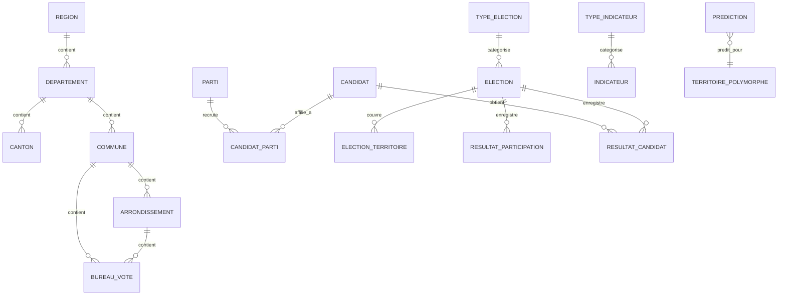

# Modèle Conceptuel de Données (MCD)

**Version :** 3.0
**Architecture :** Hiérarchie géographique + Système polymorphe de territoire

---

## Vue d'Ensemble

Le MCD structure les données nécessaires à la prédiction des tendances électorales en croisant :
- **Hiérarchie géographique** (Région → Département → Canton/Commune → Arrondissement → Bureau de vote)
- **Candidats et partis politiques** avec affiliations temporelles
- **Élections** multi-types (Présidentielles, Législatives, etc.) avec granularités variables
- **Résultats électoraux** séparés (Participation + Résultats par candidat)
- **Indicateurs socio-économiques** (Sécurité, Emploi, Démographie) avec système polymorphe
- **Prédictions ML** avec traçabilité complète

---

## Diagramme Entité-Association

### Notation Crow's Foot (Mermaid ERD) - Vue Simplifiée



---

## Entités

### 🌍 Hiérarchie Géographique

#### 1. REGION
```
region {
    varchar_2 id_region PK "Ex: '75'"
    varchar_2 code_insee
    varchar_100 nom_region
    integer population
    timestamp created_at
}
```

#### 2. DEPARTEMENT
```
departement {
    varchar_3 id_departement PK "Ex: '33'"
    varchar_2 id_region FK
    varchar_3 code_insee
    varchar_100 nom_departement
    integer population
    varchar_5 chef_lieu
    timestamp created_at
}
```

#### 3. CANTON
```
canton {
    varchar_10 id_canton PK
    varchar_3 id_departement FK
    varchar_10 code_canton
    integer numero_canton
    varchar_100 nom_canton
    integer population
    timestamp created_at
}
```

#### 4. COMMUNE
```
commune {
    varchar_5 id_commune PK "Code INSEE 5 caractères"
    varchar_3 id_departement FK
    varchar_5 code_insee
    varchar_100 nom_commune
    integer population
    varchar_200 adresse_mairie
    timestamp created_at
}
```

#### 5. ARRONDISSEMENT
```
arrondissement {
    varchar_10 id_arrondissement PK
    varchar_5 id_commune FK
    integer numero_arrondissement
    varchar_100 nom_arrondissement
    integer population
    timestamp created_at
}
```

#### 6. BUREAU_VOTE
```
bureau_vote {
    varchar_15 id_bureau PK
    varchar_5 id_commune FK
    varchar_10 id_arrondissement FK "Nullable"
    varchar_50 numero_bureau
    varchar_200 adresse
    integer nombre_inscrits
    timestamp created_at
}
```

**Notes :**
- Canton et Commune sont **parallèles** (granularités alternatives)
- Bureau de vote peut dépendre de Commune OU Arrondissement
- Pas de colonne `geometry` (simplification v3.0)

---

### 👤 Candidats et Partis

#### 7. CANDIDAT
```
candidat {
    serial id_candidat PK
    varchar_100 nom
    varchar_100 prenom
    varchar_200 nom_complet COMPUTED "prenom || ' ' || nom"
    date date_naissance
    varchar_200 profession
    text biographie
    varchar_500 photo_url
    json metadata_
    timestamp created_at
}
```

#### 8. PARTI
```
parti {
    serial id_parti PK
    varchar_20 code_parti UK "Ex: 'RE', 'RN', 'LFI'"
    varchar_200 nom_officiel
    varchar_100 nom_court
    varchar_50 classification_ideologique "extreme_gauche, gauche, centre, droite, extreme_droite"
    decimal_3_2 position_economique "-1.0 à +1.0"
    decimal_3_2 position_sociale "-1.0 à +1.0"
    varchar_7 couleur_hex
    varchar_500 logo_url
    date date_creation
    date date_dissolution
    integer successeur_id FK "Auto-référence"
    json metadata_
    timestamp created_at
}
```

#### 9. CANDIDAT_PARTI (Association temporelle)
```
candidat_parti {
    serial id_affiliation PK
    integer id_candidat FK
    integer id_parti FK
    date date_debut
    date date_fin "Nullable"
    varchar_200 fonction
    timestamp created_at
}
```

**Contrainte unicité :** `(id_candidat, id_parti, date_debut)` → Évite doublons

---

### 🗳️ Élections

#### 10. TYPE_ELECTION
```
type_election {
    serial id_type_election PK
    varchar_20 code_type UK "PRES, LEG, MUN, EUR, REG, DEP, SENAT"
    varchar_100 nom_type
    varchar_50 mode_scrutin
    varchar_50 niveau_geographique
    text description
    timestamp created_at
}
```

#### 11. ELECTION
```
election {
    serial id_election PK
    integer id_type_election FK
    integer annee "2000-2100"
    date date_tour1
    date date_tour2 "Nullable"
    integer nombre_tours "1 ou 2"
    text contexte
    json metadata_
    timestamp created_at
}
```

**Contrainte unicité :** `(id_type_election, annee, date_tour1)`

#### 12. ELECTION_TERRITOIRE (Granularités disponibles)
```
election_territoire {
    bigserial id_election_terr PK
    integer id_election FK
    varchar_15 id_territoire "ID polymorphe"
    varchar_20 type_territoire "BUREAU, CANTON, COMMUNE, DEPARTEMENT, REGION, NATIONAL"
    varchar_20 granularite_source
    varchar_20 statut_validation "EN_COURS, VALIDE, PARTIEL"
    timestamp created_at
}
```

**Rôle :** Tracker les granularités disponibles par élection (certaines élections n'ont que des données cantonales, d'autres au niveau bureau).

**Contrainte unicité :** `(id_election, id_territoire, type_territoire)`

---

### 📊 Résultats Électoraux

#### 13. RESULTAT_PARTICIPATION (Stats globales par territoire/tour)
```
resultat_participation {
    bigserial id_resultat_part PK
    integer id_election FK
    varchar_15 id_territoire "ID polymorphe"
    varchar_20 type_territoire "Type de territoire"
    integer tour "1 ou 2"
    integer nombre_inscrits
    integer nombre_abstentions
    integer nombre_votants
    integer nombre_blancs_nuls
    integer nombre_exprimes
    decimal_5_2 pourcentage_abstentions COMPUTED
    decimal_5_2 pourcentage_votants COMPUTED
    decimal_5_2 pourcentage_blancs_nuls_inscrits COMPUTED
    decimal_5_2 pourcentage_blancs_nuls_votants COMPUTED
    decimal_5_2 pourcentage_exprimes_inscrits COMPUTED
    decimal_5_2 pourcentage_exprimes_votants COMPUTED
    json metadata_
    timestamp created_at
}
```

**Contraintes d'intégrité :**
- `nombre_votants + nombre_abstentions = nombre_inscrits`
- `nombre_exprimes + nombre_blancs_nuls = nombre_votants`

**Contrainte unicité :** `(id_election, id_territoire, type_territoire, tour)`

#### 14. RESULTAT_CANDIDAT (Résultats individuels par candidat)
```
resultat_candidat {
    bigserial id_resultat_cand PK
    integer id_election FK
    integer id_candidat FK
    varchar_15 id_territoire "ID polymorphe"
    varchar_20 type_territoire "Type de territoire"
    integer tour "1 ou 2"
    integer nombre_voix
    decimal_5_2 pourcentage_voix_inscrits
    decimal_5_2 pourcentage_voix_exprimes
    json metadata_
    timestamp created_at
}
```

**Contrainte unicité :** `(id_election, id_candidat, id_territoire, type_territoire, tour)`

**Relation avec ELECTION_TERRITOIRE :**
- FK composite : `(id_election, id_territoire, type_territoire)` → `election_territoire`

---

### 📈 Indicateurs Socio-économiques

#### 15. TYPE_INDICATEUR (Catalogue)
```
type_indicateur {
    serial id_type PK
    varchar_50 code_type UK "SECURITE_CAMBRIOLAGES"
    varchar_50 categorie "SECURITE, EMPLOI, DEMOGRAPHIE"
    varchar_100 nom_affichage
    text description
    varchar_50 unite_mesure "nombre, pourcentage, taux"
    varchar_100 source_officielle "SSMSI, INSEE, DARES"
    varchar_20 frequence "ANNUEL, TRIMESTRIEL, MENSUEL"
    date date_debut_disponibilite
    boolean actif
    jsonb schema_metadata
    timestamp created_at
}
```

#### 16. INDICATEUR (Table générique avec système polymorphe)
```
indicateur {
    bigserial id_indicateur PK
    varchar_15 id_territoire "ID polymorphe (ex: '33063', '33', '75')"
    varchar_20 type_territoire "COMMUNE, CANTON, DEPARTEMENT, REGION, NATIONAL"
    integer id_type FK
    integer annee "2000-2100"
    varchar_20 periode "T1-T4, M01-M12, NULL"
    decimal_15_4 valeur_numerique
    text valeur_texte
    jsonb metadata
    varchar_200 source_detail
    varchar_20 fiabilite "CONFIRME, ESTIME, PROVISOIRE, REVISION"
    timestamp created_at
}
```

**Système polymorphe :**
- `id_territoire` + `type_territoire` → Référence flexible sans FK classique
- Permet de lier à COMMUNE, CANTON, DEPARTEMENT, REGION selon contexte

**Contrainte unicité :** `(id_territoire, type_territoire, id_type, annee, periode)`

---

### 🔮 Prédictions ML

#### 17. PREDICTION (Output Machine Learning)
```
prediction {
    bigserial id_prediction PK
    varchar_15 id_territoire "ID polymorphe"
    varchar_20 type_territoire "Type de territoire"
    varchar_100 candidat
    varchar_50 parti
    integer annee_prediction "2025-2050"
    integer tour "1 ou 2"
    decimal_5_2 pourcentage_predit
    decimal_5_2 intervalle_confiance_inf
    decimal_5_2 intervalle_confiance_sup
    varchar_50 modele_utilise "RandomForest, XGBoost"
    varchar_20 version_modele "v1.2.0"
    jsonb metriques_modele "R2, MAE, RMSE"
    jsonb features_utilisees
    timestamp date_generation
}
```

**Contrainte unicité :** `(id_territoire, type_territoire, candidat, tour, annee_prediction, version_modele)` → Versioning des prédictions

---

## Relations et Cardinalités

### Hiérarchie Géographique
- **REGION → DEPARTEMENT** : 1:N (CASCADE)
- **DEPARTEMENT → CANTON** : 1:N (CASCADE)
- **DEPARTEMENT → COMMUNE** : 1:N (CASCADE)
- **COMMUNE → ARRONDISSEMENT** : 1:N (CASCADE)
- **COMMUNE → BUREAU_VOTE** : 1:N (CASCADE)
- **ARRONDISSEMENT → BUREAU_VOTE** : 1:N (CASCADE, nullable)

### Candidats et Partis
- **CANDIDAT → CANDIDAT_PARTI** : 1:N (CASCADE)
- **PARTI → CANDIDAT_PARTI** : 1:N (CASCADE)
- **PARTI → PARTI** : 1:1 (successeur, SET NULL)

### Élections
- **TYPE_ELECTION → ELECTION** : 1:N (CASCADE)
- **ELECTION → ELECTION_TERRITOIRE** : 1:N (CASCADE)
- **ELECTION_TERRITOIRE → RESULTAT_PARTICIPATION** : 1:N (CASCADE via FK composite)
- **ELECTION_TERRITOIRE → RESULTAT_CANDIDAT** : 1:N (CASCADE via FK composite)
- **CANDIDAT → RESULTAT_CANDIDAT** : 1:N (CASCADE)

### Indicateurs
- **TYPE_INDICATEUR → INDICATEUR** : 1:N (RESTRICT - impossible supprimer type si indicateurs existent)
- **INDICATEUR → TERRITOIRE** : N:1 polymorphe (pas de FK classique)

### Prédictions
- **PREDICTION → TERRITOIRE** : N:1 polymorphe (pas de FK classique)

---

## Pattern Architectural : Système Polymorphe de Territoire

### Principe

Au lieu d'avoir une table `TERRITOIRE` unique avec tous types confondus, la v3.0 utilise :

1. **Hiérarchie géographique explicite** : Tables séparées (region, departement, commune, etc.)
2. **Références polymorphes** : `id_territoire` + `type_territoire` dans les tables transverses (indicateur, prediction, resultat_*)

### Avantages

| Aspect | Avantage |
|--------|----------|
| **Clarté** | Structure hiérarchique évidente |
| **Flexibilité** | Indicateurs/résultats peuvent référencer n'importe quel niveau géographique |
| **Extensibilité** | Ajout nouveaux niveaux sans refonte |
| **Performance** | Jointures ciblées selon type_territoire |

### Exemples de Références Polymorphes

```sql
-- Indicateur au niveau COMMUNE
INSERT INTO indicateur (id_territoire, type_territoire, id_type, annee, valeur_numerique)
VALUES ('33063', 'COMMUNE', 1, 2022, 504.0);

-- Indicateur au niveau DEPARTEMENT
INSERT INTO indicateur (id_territoire, type_territoire, id_type, annee, valeur_numerique)
VALUES ('33', 'DEPARTEMENT', 1, 2022, 15420.0);

-- Résultat au niveau CANTON
INSERT INTO resultat_participation (id_election, id_territoire, type_territoire, tour, nombre_inscrits)
VALUES (1, '3301', 'CANTON', 1, 45000);
```

---

## Normalisation

**Forme Normale :** 3FN (Troisième Forme Normale)

### Vérification 1FN
- ✅ Toutes les valeurs sont atomiques
- ✅ Pas de groupes répétitifs

### Vérification 2FN
- ✅ Tous attributs non-clés dépendent de la totalité de la clé primaire
- ✅ Pas de dépendances partielles

### Vérification 3FN
- ✅ Pas de dépendances transitives
- ✅ Séparation catalogues (type_indicateur, type_election) et données

---

## Volumétrie Estimée (POC Bordeaux - Gironde 33)

| Entité | Lignes Estimées | Justification |
|--------|-----------------|---------------|
| `region` | 1 | Nouvelle-Aquitaine |
| `departement` | 1 | Gironde (33) |
| `canton` | ~30 | Cantons de la Gironde |
| `commune` | ~535 | Communes de la Gironde |
| `arrondissement` | ~6 | Arrondissements de Bordeaux |
| `bureau_vote` | ~80 | Bureaux de vote Bordeaux |
| `candidat` | ~30 | Candidats présidentielles 2017+2022 |
| `parti` | ~25 | Partis politiques actifs |
| `candidat_parti` | ~40 | Affiliations historiques |
| `type_election` | ~7 | PRES, LEG, MUN, etc. |
| `election` | ~2 | Présidentielles 2017, 2022 |
| `election_territoire` | ~1 300 | 2 élections × ~650 territoires (bureaux+communes+cantons+dept) |
| `type_indicateur` | ~50 | Types d'indicateurs socio-éco |
| `indicateur` | ~20 000 | 650 territoires × 20 types × ~1.5 années moyennes |
| `resultat_participation` | ~2 600 | 650 territoires × 2 élections × 2 tours |
| `resultat_candidat` | ~31 200 | 650 territoires × 2 élections × 2 tours × ~12 candidats |
| `prediction` | ~13 000 | 650 territoires × 2 tours × ~10 candidats |
| **TOTAL** | **~69 000** | Volume raisonnable pour POC |

---

## Évolutions v2.0 → v3.0

### ❌ Suppressions
- Table `TERRITOIRE` (remplacée par hiérarchie géographique)
- Table `ELECTION_RESULT` (remplacée par `resultat_participation` + `resultat_candidat`)
- Colonne `geometry` (simplification, ajout ultérieur si besoin PostGIS)

### ✅ Ajouts
- Hiérarchie géographique complète (6 tables)
- Entités Candidat, Parti, CandidatParti
- Entités TypeElection, Election, ElectionTerritoire
- Séparation participation vs résultats candidats
- Système polymorphe de territoire (`id_territoire` + `type_territoire`)
- Colonnes calculées (COMPUTED) pour pourcentages

### 🔄 Modifications
- `INDICATEUR` : Ajout `type_territoire`, suppression FK vers `territoire`
- `PREDICTION` : Ajout `type_territoire`, suppression FK vers `territoire`

---

**Prochaine étape :** Consulter le [Modèle Logique de Données (MLD)](02-mld.md) pour le schéma relationnel détaillé SQL.
