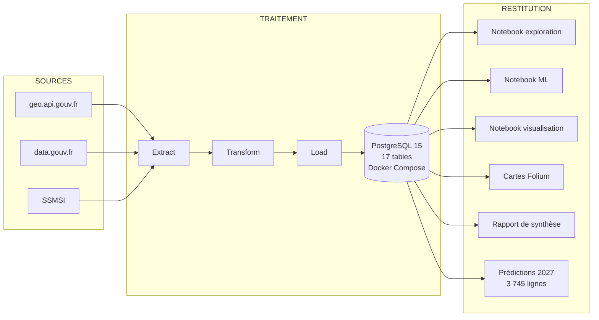

# A2 - Architecture Business Intelligence

> **Compétence C2 :** Définir une architecture business intelligence à partir des orientations stratégiques afin de mettre à disposition des utilisateurs métiers les données structurées d'un SI.

---

## 1. Choix technologiques (5 ADRs)

| ADR | Décision | Alternative écartée | Justification |
|-----|----------|---------------------|---------------|
| ADR-001 | **PostgreSQL** | MongoDB, SQLite | SQL avancé, intégrité ACID, PostGIS, compatibilité Pandas |
| ADR-002 | **Random Forest** | XGBoost, LSTM, SVM | Non-linéaire, feature importance, peu de tuning, POC 25h |
| ADR-003 | **ETL modulaire (Option 3)** | Fichiers plats, Option 1/2 | Séparation config/core/utils, testabilité, standards enterprise |
| ADR-004 | **Schéma v3.0** | Schéma v1/v2 | Système polymorphe de territoire, normalisation 3NF |
| ADR-005 | **Périmètre Gironde** | Bordeaux seul, National | Volume maîtrisable (534 communes), richesse statistique |

## 2. Architecture globale

## 3. Schéma de données (MCD v3.0)

**17 tables** organisées en 5 domaines :

| Domaine | Tables | Lignes |
|---------|--------|--------|
| Géographie | Region, Departement, Commune, Canton, Arrondissement, Bureau | 537 |
| Candidats | Candidat, Parti, CandidatParti | 56 |
| Élections | TypeElection, Election, ElectionTerritoire | 1 076 |
| Résultats | ResultatParticipation, ResultatCandidat | 16 630 |
| Indicateurs + ML | TypeIndicateur, Indicateur, Prediction | 3 795 |
| **Total** | **17 tables** | **~21 000** |

**Innovation architecturale** : système polymorphe `(id_territoire, type_territoire)` permettant de stocker résultats, indicateurs et prédictions à n'importe quel niveau géographique sans jointures multiples.

## 4. Stack technique

| Couche | Technologie | Version |
|--------|-------------|---------|
| Langage | Python | 3.12 |
| ORM | SQLAlchemy | 2.x |
| Migrations | Alembic | 1.16+ |
| BDD | PostgreSQL + PostGIS | 15 |
| ML | Scikit-Learn | 1.5+ |
| Visualisation | Matplotlib, Seaborn, Folium | - |
| Infrastructure | Docker Compose | - |
| Packages | UV | - |

**Fichiers de référence :**
- Architecture complète : `docs/02-architecture/ARCHITECTURE.md`
- ADRs : `docs/02-architecture/adr/ADR-001` à `ADR-005`
- MCD/MLD : `docs/02-architecture/database/01-mcd.md`, `02-mld.md`
- Dictionnaire : `docs/02-architecture/database/03-dictionnaire-donnees.md`
