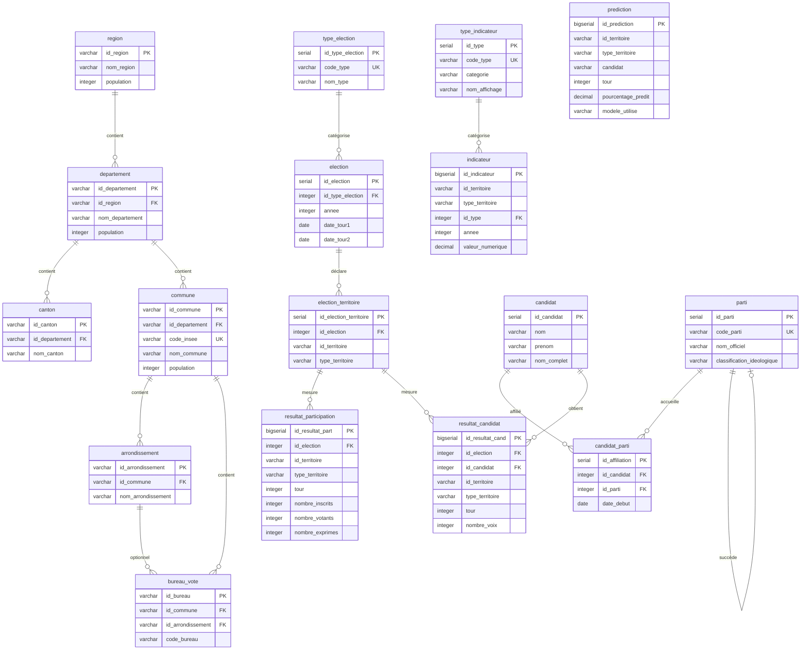

# B2 - Entrepôt de Données & Référentiels

> **Compétence C6 :** Définir les données de référence à partir des données utilisées pour créer un référentiel afin d'assurer la mise à disposition de données cohérentes.
> **Compétence C7 :** Créer un entrepôt unique à partir du référentiel pour centraliser les informations stratégiques et répondre rapidement aux besoins métiers.

---

## 1. Entrepôt unique : PostgreSQL 15

| Paramètre | Valeur |
|-----------|--------|
| SGBD | PostgreSQL 15 + PostGIS |
| Schéma | v3.0 normalisé 3NF |
| Tables | 17 |
| Lignes totales | ~21 000 |
| Infrastructure | Docker Compose |
| ORM | SQLAlchemy 2.x |
| Migrations | Alembic (4 versions) |

## 2. MLD (v3.0)

## Diagramme Relationnel

## 3. Référentiels définis

### Référentiel géographique

| Table | Clé | Exemples | Lignes |
|-------|-----|----------|--------|
| `region` | id_region | Nouvelle-Aquitaine | 1 |
| `departement` | id_departement | Gironde (33) | 1 |
| `commune` | id_commune | Bordeaux (33063), Mérignac (33281)... | 534 |

### Référentiel candidats & partis

| Table | Clé | Exemples | Lignes |
|-------|-----|----------|--------|
| `candidat` | id_candidat | Macron, Le Pen, Mélenchon... | 16 |
| `parti` | id_parti | RE, RN, LFI... | 15 |
| `candidat_parti` | (id_candidat, id_parti) | Association candidat-parti | 25 |

### Référentiel élections

| Table | Clé | Exemples | Lignes |
|-------|-----|----------|--------|
| `type_election` | id_type | Présidentielle | 1 |
| `election` | id_election | 2017, 2022 | 2 |

### Référentiel indicateurs

| Table | Clé | Exemples | Lignes |
|-------|-----|----------|--------|
| `type_indicateur` | id_type | Criminalité totale, Vols, Atteintes... | 5 |

## 4. Contraintes d'intégrité

| Type | Nombre | Exemple |
|------|--------|---------|
| Clés primaires | 17 | `commune.id_commune` |
| Clés étrangères | 12 | `commune.id_departement → departement` |
| UNIQUE | 8 | `(id_territoire, candidat, tour, annee, version)` |
| CHECK | 10 | `pourcentage BETWEEN 0 AND 100` |
| NOT NULL | ~50 | Colonnes obligatoires |

## 5. Historique des versions

| Version | Date | Changement |
|---------|------|-----------|
| v1.0 | 2026-02-09 | Schéma initial (8 tables) |
| v2.0 | 2026-02-10 | Séparation participation/résultats |
| v3.0 | 2026-02-12 | Système polymorphe, 17 tables, table prediction |

## 6. Dictionnaire de données

Extrait pour les tables clés :

| Table.Colonne | Type | Description |
|---------------|------|-------------|
| `commune.id_commune` | VARCHAR(5) | Code INSEE (ex: 33063) |
| `commune.population` | INTEGER | Population municipale |
| `resultat_candidat.pourcentage_voix_exprimes` | NUMERIC(5,2) | % voix (0-100) |
| `prediction.pourcentage_predit` | NUMERIC(5,2) | % prédit ML (0-100) |
| `prediction.intervalle_confiance_inf` | NUMERIC(5,2) | Borne inf IC 95% |
| `prediction.metriques_modele` | JSONB | {r2, mae, rmse, feature_importance} |

**Fichiers de référence :**
- Modèles ORM : `src/database/models/`
- MCD : `docs/02-architecture/database/01-mcd.md`
- MLD : `docs/02-architecture/database/02-mld.md`
- Dictionnaire complet : `docs/02-architecture/database/03-dictionnaire-donnees.md`
- Règles de gestion : `docs/02-architecture/database/04-regles-gestion.md`
- Contraintes : `docs/02-architecture/database/05-contraintes-integrite.md`
